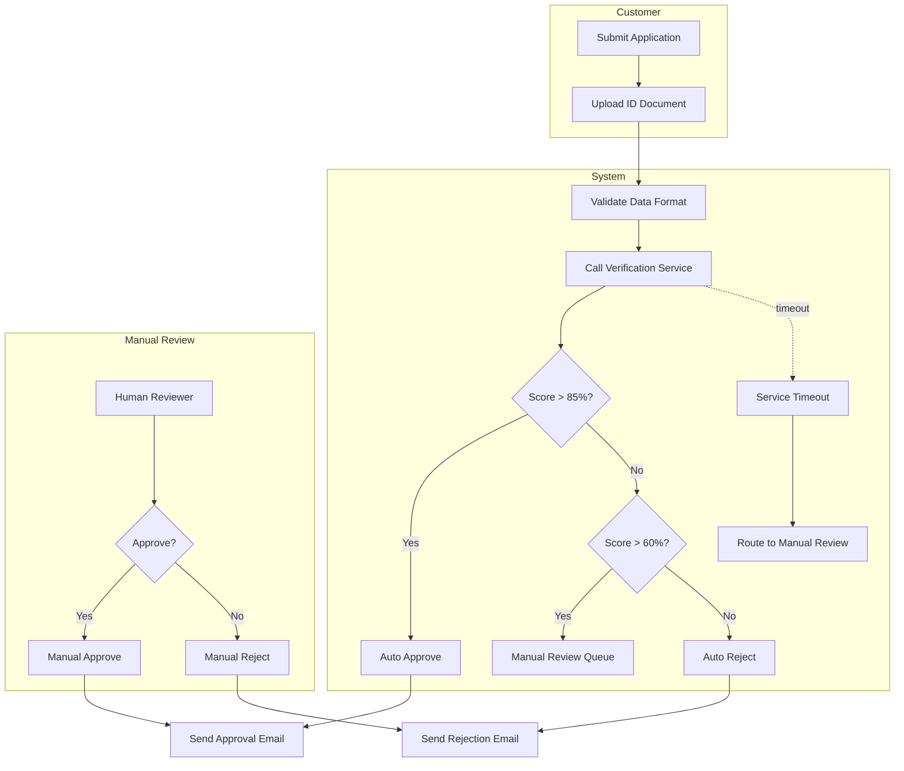

# GitHub Copilot for Business & Systems Analysts - Lab Guide

## Welcome & Overview

Welcome to the hands-on lab for "GitHub Copilot for Business & Systems Analysts"! This 75-minute interactive session will transform how you approach requirements documentation, process modeling, and data analysis. You'll learn to leverage GitHub Copilot as a powerful assistant that amplifies your analytical skills while maintaining the critical thinking and domain expertise that makes you valuable.

### Session Objectives

By the end of this session, you will be able to:

1. **Transform unstructured inputs into well-formed requirements artifacts** using Copilot-assisted techniques
2. **Generate comprehensive acceptance criteria and test scenarios** that cover positive, negative, and edge cases
3. **Create technical documentation** including process flows, data contracts, and traceability matrices
4. **Apply proven prompt patterns** that consistently produce high-quality outputs for analyst work

### Who This Is For

This lab is designed for:
- Business Analysts transforming stakeholder conversations into structured requirements
- Systems Analysts documenting complex processes and data flows
- Product Owners managing backlogs and user story creation
- QA/UAT leads creating comprehensive test scenarios
- Anyone responsible for bridging business needs and technical implementation

### What You'll Learn

- **Prompt Engineering for Analysts:** The five-part pattern that works consistently
- **Quality Assurance:** How to verify and critique Copilot outputs using proven frameworks
- **Compliance & Governance:** Safe practices for regulated environments
- **Practical Applications:** Real-world scenarios you'll face in your daily work

### Repository Structure Guide

This repository contains two learning paths and comprehensive supporting materials:

```
copilot-analysts-lab/
├── setup/                    # Prerequisites and Copilot configuration
├── path-a-backlog/          # Backlog management track (stakeholder notes → stories)
├── path-b-process-data/     # Process & data track (policy docs → technical specs)
├── homework/                # Extended practice assignments
├── resources/               # Reference guides and troubleshooting
└── lab-guide.md            # This comprehensive guide
```

## Before You Begin

### Prerequisites Verification

Before starting the hands-on exercises, ensure you have completed all setup requirements:

**Required Setup:**
- [ ] GitHub Copilot Business or Enterprise license is active
- [ ] VS Code or JetBrains IDE installed with latest updates
- [ ] GitHub Copilot extension installed and enabled
- [ ] GitHub Copilot Chat extension installed
- [ ] Access to this training repository (cloned locally)
- [ ] Public Code Filter enabled in Copilot settings
- [ ] Ability to create and edit markdown files
- [ ] Markdown preview working in your IDE

**Recommended Setup:**
- [ ] Familiar with basic markdown syntax
- [ ] Have worked with user stories or requirements documentation before
- [ ] Basic understanding of business analysis concepts (INVEST, acceptance criteria)

If any required items are not complete, please refer to the detailed setup instructions in `/setup/copilot-setup.md` before proceeding.

### Copilot Setup Steps

**Quick Setup Verification:**

1. **Test Copilot Status**
   - Open VS Code or your IDE
   - Look for Copilot icon in the status bar (bottom-right)
   - Should show "Copilot ready" or similar active status
   - If not active, click the icon to sign in

2. **Test Copilot Chat**
   - Press `Ctrl+Shift+I` (Windows/Linux) or `Cmd+Shift+I` (Mac)
   - Copilot Chat panel should open
   - Type: "Hello, are you working?"
   - Should receive a response from Copilot

3. **Verify Public Code Filter**
   - In VS Code: Settings → Extensions → GitHub Copilot
   - Ensure "Enable Public Code Filter" is checked
   - Status bar should show "Filter: On" when Copilot is active

4. **Test with Simple Prompt**
   - Create a new file: `test-copilot.md`
   - In Copilot Chat, type: "Create a simple user story for a login feature"
   - Verify you get a properly formatted response

### Repository Clone Instructions

**If you haven't already cloned this repository:**

```bash
# Clone the repository
git clone [REPOSITORY_URL]
cd copilot-analysts-lab

# Verify structure
ls -la
# Should see: setup/, path-a-backlog/, path-b-process-data/, homework/, resources/
```

**Set up your workspace:**

```bash
# Create a personal workspace (ignored by git)
mkdir my-work
cd my-work

# This is where you'll create your exercise files
```

### Quick Test: "Does Copilot Work?"

Before proceeding to the main exercises, complete this 2-minute verification test:

1. **Create test file:** `my-work/copilot-test.md`
2. **Open Copilot Chat** and paste this prompt:

```
You are a business analyst. Create one user story for a customer who wants to reset their password. Include the story in "As a... I want... So that..." format and add 2 acceptance criteria.
```

3. **Expected result:** You should receive a properly formatted user story with clear acceptance criteria
4. **If it works:** You're ready to proceed!
5. **If it doesn't work:** Check the troubleshooting guide at `/resources/copilot-troubleshooting.md`

## Session Structure

### Timeline Overview

This session follows a structured 75-minute format:

**00:00 - 10:00 | Welcome & Context** *(not in repository)*
- Why Copilot matters for analysts
- Success stories and use cases
- Live demonstration

**10:00 - 25:00 | Patterns & Guardrails** *(reference: `/resources/`)*
- Five-part prompt pattern
- Quality verification techniques
- Compliance and security practices

**25:00 - 65:00 | Hands-On Lab** *(this repository)*
- Choose Path A or Path B
- Complete 3 progressive exercises
- Apply patterns and verification techniques

**65:00 - 75:00 | Debrief & Next Steps**
- Peer review using 2x2 framework
- Homework assignment overview
- Continued learning resources

### Path A vs Path B Explanation

This lab offers two specialized tracks to match your primary responsibilities:

**Path A: Backlog from Notes**
- **Focus:** Stakeholder notes → Epics → User stories → GitHub Issues
- **Skills:** Story decomposition, acceptance criteria, INVEST validation
- **Artifacts:** Epics, user stories, Gherkin scenarios, GitHub issues
- **Best for:** Business analysts, product owners, backlog managers
- **Time:** 40 minutes across 3 exercises

**Path B: Process & Data**
- **Focus:** Policy documents → Process flows → Data contracts → UAT cases
- **Skills:** Process modeling, data schema design, traceability management
- **Artifacts:** Mermaid flowcharts, OpenAPI schemas, UAT test cases, RTM
- **Best for:** Systems analysts, data analysts, process improvement specialists
- **Time:** 40 minutes across 3 exercises

### How to Choose

**Choose Path A if you primarily:**
- Facilitate stakeholder meetings and capture requirements
- Write user stories and manage product backlogs
- Work directly with product owners and development teams
- Focus on feature definition and acceptance criteria

**Choose Path B if you primarily:**
- Document business processes and system integrations
- Design data models and API specifications
- Create test plans and traceability matrices
- Work with compliance requirements and system documentation

**Can't decide?** Path A is more foundational and recommended for mixed roles.

## Detailed Path A Walkthrough

### Overview of 3 Exercises

Path A transforms messy stakeholder notes into production-ready requirements through these progressive exercises:

**Exercise 1: Epic & Story Generation (12 minutes)**
- Input: Raw stakeholder meeting notes
- Output: 2-3 well-formed epics and 3-5 INVEST-compliant user stories
- Skills: Information extraction, story decomposition, INVEST validation

**Exercise 2: Acceptance Criteria & Gherkin (13 minutes)**
- Input: Your user stories from Exercise 1
- Output: Comprehensive Gherkin scenarios covering positive, negative, and edge cases
- Skills: Scenario design, test thinking, edge case identification

**Exercise 3: GitHub Issues & Traceability (15 minutes)**
- Input: Your stories and scenarios from previous exercises
- Output: Complete GitHub issues with full traceability and ready for sprint planning
- Skills: Issue formatting, traceability documentation, DoR verification

### Exercise 1: Epic & Story Generation (25:00 - 37:00)

**Objective:** Transform stakeholder notes into structured epics and INVEST-compliant user stories

**Prerequisites:**
- [ ] Review `/path-a-backlog/inputs/stakeholder-notes.md` (3 minutes reading time)
- [ ] Have `/path-a-backlog/prompts/01-epic-generation-prompts.md` open for reference
- [ ] Have `/path-a-backlog/templates/invest-checklist.md` available

**Step 1: Generate Epics (4 minutes)**

1. **Create your workspace:**
   ```bash
   # In my-work/ directory
   touch my-epics.md
   ```

2. **Open Copilot Chat** (`Ctrl+Shift+I` or `Cmd+Shift+I`)

3. **Use this exact prompt pattern:**
   ```
   You are a senior business analyst in a regulated financial services environment.

   Review these stakeholder notes from our product discovery session:
   [COPY-PASTE content from inputs/stakeholder-notes.md]

   Generate 2-3 epics that capture the high-level business capabilities.

   For each epic, provide:
   - Epic Title: [Concise, business-focused]
   - Description: [2-3 sentences]
   - Business Value: [Problem being solved + expected outcome]
   - Key Assumptions: [2-3 assumptions that need validation]
   - High-level story themes: [3-5 story areas]

   Constraints:
   - Each epic should represent 2-4 weeks of work
   - Focus on customer-facing capabilities
   - Flag any compliance requirements
   - Identify dependencies on external systems
   ```

4. **Save results** to `my-epics.md`

**Checkpoint ✓ (1 minute):** Share one epic title with a neighbor. Does it clearly describe a business capability that sounds achievable in 2-4 weeks?

**Step 2: Split Epic into Stories (5 minutes)**

1. **Create new file:** `my-stories.md`

2. **Choose your best epic** from Step 1

3. **Use this prompt:**
   ```
   You are a business analyst. Take this epic and split it into 3-5 user stories following INVEST principles.

   [PASTE YOUR CHOSEN EPIC]

   For each story, provide:
   - User story in format: As a [role], I want [capability], so that [benefit]
   - 2-3 acceptance criteria (brief, will detail later)
   - Estimated complexity: Small/Medium/Large
   - Priority: High/Medium/Low

   Each story should be:
   - Independent (can be developed separately)
   - Valuable (delivers customer/business benefit)
   - Estimable (team can size it)
   - Small (completable in 1 sprint)
   - Testable (clear success criteria)
   ```

4. **Save results** to `my-stories.md`

**Step 3: Apply INVEST Checklist (3 minutes)**

1. **Pick your best story** from Step 2

2. **Open** `/path-a-backlog/templates/invest-checklist.md`

3. **Score your story** against the 6 INVEST criteria

4. **If score is 4 or below, use this fix prompt:**
   ```
   This user story needs improvement:
   [PASTE YOUR STORY]

   It fails these INVEST criteria: [LIST FAILED CRITERIA]

   Rewrite the story to address these gaps while maintaining the core business value.
   ```

**Checkpoint ✓:** Your story should score 5-6 on the INVEST checklist.

**What Success Looks Like:**

```markdown
## Epic 1: Customer Balance Alert Management

**Description:**
Enable customers to configure and receive automated alerts when their account balance crosses defined thresholds, helping them avoid overdrafts and manage cash flow proactively.

**Business Value:**
- Problem: 30% of customers incur overdraft fees that could be prevented
- Expected Outcome: Reduce overdraft incidents by 25-30% within 6 months
- Competitive Necessity: Industry standard feature required for retention

**Key Assumptions:**
- Real-time balance updates available from core banking system
- Integration with existing notification platform is feasible
- Customer preference data can be stored in existing profile database

**Story Themes:**
1. Threshold configuration and management
2. Multi-channel alert delivery (email, SMS, push)
3. Alert history and audit trail
4. Account type-specific alert rules
5. Compliance with TCPA notification regulations

---

### US-001: Customer Sets Custom Alert Threshold

**As a** retail banking customer  
**I want** to set a custom dollar threshold for low balance alerts  
**So that** I can avoid overdraft fees and manage my cash flow proactively

**Acceptance Criteria:**
- AC1: Customer can set threshold between $0-$1000
- AC2: System validates threshold format and saves to customer profile
- AC3: Threshold changes take effect for next balance check

**Complexity:** Small  
**Priority:** High

**INVEST Score:** 6/6 ✓
```

**Common Issues & Fixes:**

**Issue:** Stories too large/complex
**Fix Prompt:** "This story is too large. Split it into 2 smaller stories, each deliverable in 3-5 days."

**Issue:** Missing business value
**Fix Prompt:** "Strengthen the 'so that' clause. Make the business value explicit and measurable."

**Issue:** Stories aren't independent
**Fix Prompt:** "These stories depend on each other. Rewrite them to be independent or clearly document the dependency."

### Exercise 2: Acceptance Criteria & Gherkin (37:00 - 50:00)

**Objective:** Transform basic acceptance criteria into comprehensive, testable Gherkin scenarios

**Prerequisites:**
- [ ] Your completed stories from Exercise 1
- [ ] Review `/resources/gherkin-reference.md` for syntax reminder
- [ ] Have `/path-a-backlog/prompts/03-gherkin-prompts.md` open

**Step 1: Generate Positive Scenarios (5 minutes)**

1. **Create new file:** `my-scenarios.md`

2. **Choose 2-3 of your best stories** from Exercise 1

3. **For each story, use this prompt:**
   ```
   You are a business analyst creating Gherkin scenarios for UAT testing.

   Convert this user story into 2-3 detailed Gherkin scenarios that cover the positive (happy path) cases:

   [PASTE ONE STORY WITH ITS ACCEPTANCE CRITERIA]

   Use this format:
   ```gherkin
   Scenario: [Descriptive scenario name]
     Given [specific precondition with actual data]
     When [specific user action]
     Then [specific, measurable outcome]
   ```

   Requirements:
   - Use specific data values (dollar amounts, account numbers, dates)
   - Make assertions measurable and verifiable
   - Cover each acceptance criterion with at least one scenario
   - Include system responses and user feedback
   ```

4. **Review output** - scenarios should be specific, not vague

**Good Example:**
```gherkin
Scenario: Customer sets valid alert threshold
  Given I am logged into my account
  And my current balance is $850.00
  When I navigate to Alert Settings
  And I set my low balance threshold to $100.00
  And I click "Save Settings"
  Then I see confirmation message "Alert threshold saved successfully"
  And my threshold displays as "$100.00" in the settings
  And I receive email "Your low balance alert has been updated"
```

**Step 2: Generate Negative & Edge Cases (5 minutes)**

1. **Use this prompt for each story:**
   ```
   Now create 2-3 negative and edge case scenarios for this same story:

   [PASTE THE SAME STORY]

   Focus on:
   - Invalid inputs (negative amounts, text in number fields)
   - Boundary conditions (minimum/maximum values)
   - System error conditions (service unavailable, timeout)
   - Business rule violations (existing regulations, account restrictions)
   - User error scenarios (navigation mistakes, double-clicks)

   Each scenario should test what happens when things go wrong.
   ```

**Good Example:**
```gherkin
Scenario: Customer attempts to set negative threshold
  Given I am logged into my account
  When I navigate to Alert Settings
  And I enter "-50.00" in the threshold field
  And I click "Save Settings"
  Then I see error message "Threshold must be $0.00 or greater"
  And my previous threshold remains unchanged
  And the threshold field shows red validation border
```

**Step 3: Review for Completeness (3 minutes)**

1. **Use this review prompt:**
   ```
   Review these Gherkin scenarios for completeness:

   [PASTE ALL YOUR SCENARIOS]

   Check for:
   1. Are all acceptance criteria covered by at least one scenario?
   2. Are scenarios specific enough to be executed by a tester?
   3. Are expected outcomes measurable and verifiable?
   4. Have we covered the most important negative cases?
   5. Are there any obvious edge cases missing?

   Suggest any additional scenarios needed or improvements to existing ones.
   ```

2. **Apply suggested improvements**

**Checkpoint ✓:** Each acceptance criterion should be covered by at least one scenario, and you should have both positive and negative test cases.

**What Success Looks Like:**

Your scenarios should be:
- **Specific:** Use real data values, not placeholders
- **Executable:** A tester could follow the steps exactly
- **Measurable:** Expected outcomes can be objectively verified
- **Complete:** Cover all acceptance criteria plus important edge cases

### Exercise 3: GitHub Issues & Traceability (50:00 - 65:00)

**Objective:** Convert stories and scenarios into complete GitHub issues ready for sprint planning

**Prerequisites:**
- [ ] Your completed stories and scenarios from Exercises 1-2
- [ ] Review `/path-a-backlog/templates/github-issue-template.md`
- [ ] Have `/path-a-backlog/prompts/04-issue-creation-prompts.md` open

**Step 1: Format GitHub Issues (8 minutes)**

1. **Create new file:** `my-issues.md`

2. **For each of your 2-3 best stories, use this prompt:**
   ```
   Convert this user story and Gherkin scenarios into a complete GitHub issue using our template format:

   USER STORY:
   [PASTE ONE STORY]

   GHERKIN SCENARIOS:
   [PASTE SCENARIOS FOR THIS STORY]

   Create a GitHub issue that includes:
   - Properly formatted title: [US-###] [Brief description]
   - Complete issue body with all required sections
   - All Gherkin scenarios in code blocks
   - Definition of Ready checklist
   - Source documentation references
   - Suggested labels and project assignment

   Use the format from /path-a-backlog/templates/github-issue-template.md
   ```

**Step 2: Add Traceability (4 minutes)**

1. **For each issue, enhance with this prompt:**
   ```
   Add traceability information to this GitHub issue:

   [PASTE YOUR ISSUE]

   Add these sections:
   - **Source Documentation:** Reference the original stakeholder meeting notes
   - **Related Requirements:** Link to epic and any policy requirements
   - **Dependencies:** Technical and business dependencies identified
   - **Risks:** Delivery risks and mitigation strategies

   Base this on the original stakeholder notes from inputs/stakeholder-notes.md
   ```

**Step 3: Self-Review & DoR Check (3 minutes)**

1. **Use this final review prompt:**
   ```
   Review this GitHub issue for sprint readiness:

   [PASTE YOUR COMPLETE ISSUE]

   Check against our Definition of Ready:
   1. Story follows proper format with clear business value
   2. At least 2-3 testable acceptance criteria
   3. Dependencies and risks identified
   4. Source traceability documented
   5. Estimation possible by development team
   6. No blocking unknowns

   Rate each criterion (Pass/Fail) and suggest specific improvements for any failures.
   ```

2. **Apply improvements** before proceeding

**Checkpoint ✓:** Your issue should pass all Definition of Ready criteria.

**What Success Looks Like:**

```markdown
# [US-001] Customer can set account balance alert threshold

## User Story

**As a** retail banking customer  
**I want** to set a custom dollar threshold for low balance alerts  
**So that** I can avoid overdraft fees and manage my cash flow proactively

## Acceptance Criteria

```gherkin
Scenario: Customer sets valid alert threshold
  Given I am logged into my account
  And my current balance is $850.00
  When I navigate to Alert Settings
  And I set my low balance threshold to $100.00
  And I click "Save Settings"
  Then I see confirmation message "Alert threshold saved successfully"
  And my threshold displays as "$100.00" in the settings

Scenario: Customer attempts invalid threshold
  Given I am logged into my account
  When I navigate to Alert Settings
  And I enter "-50.00" in the threshold field
  And I click "Save Settings"
  Then I see error message "Threshold must be $0.00 or greater"
  And my previous threshold remains unchanged
```

## Definition of Ready

- [x] Dependencies identified
- [x] AC defined and testable
- [x] Story sized (Small)
- [x] No blockers
- [x] SME review completed

## Source Documentation

- **Meeting:** Product Discovery Session, October 15, 2024
- **Attendees:** Product Owner (Jane D.), Business Analyst, Senior Dev Lead
- **Policy Reference:** Customer Notification Policy v3.2, Section 4.1
- **Related Epic:** Epic-1 Customer Balance Alert Management

## Technical Dependencies

- Customer Profile Service API (for threshold storage)
- Core Banking System (for real-time balance data)
- Notification Service (for alert delivery)

## Risks & Mitigation

- **MEDIUM:** Legacy profile system integration complexity
  - *Mitigation:* Spike story for API research in previous sprint
- **LOW:** Mobile app team coordination needed
  - *Mitigation:* Requirements shared 24 hours in advance

**Labels:** `feature` `needs-review` `sprint-backlog` `path-a` `customer-alerts`

**Project:** Training Project - Sprint 1
```

### Time Management Tips for Path A

**If you're ahead of schedule:**
- Add more comprehensive edge cases to your Gherkin scenarios
- Create additional user stories from your epics
- Practice the critique prompts from homework assignments
- Help a neighbor with their exercises

**If you're behind schedule:**
- Focus on quality over quantity - complete 2 really good stories rather than 4 mediocre ones
- Use the solution examples as guides but don't copy them exactly
- Skip the enhancement prompts and focus on core requirements
- Ask facilitator for assistance

**Common Time Wasters:**
- Over-thinking epic generation - 2-3 epics maximum
- Making scenarios too complex - simple is better
- Perfectionism in formatting - focus on content quality
- Not using the provided prompt templates

## Detailed Path B Walkthrough

### Overview of 3 Exercises

Path B transforms policy documents into technical specifications and test artifacts through these progressive exercises:

**Exercise 1: Process Flow Modeling (15 minutes)**
- Input: Customer onboarding policy document
- Output: Mermaid flowcharts showing basic process and swimlane views
- Skills: Process extraction, flowchart design, decision point modeling

**Exercise 2: Data Contract Generation (12 minutes)**
- Input: Policy requirements and your process flows
- Output: OpenAPI schema with comprehensive validation rules
- Skills: Data modeling, API design, validation specification

**Exercise 3: Traceability & UAT (13 minutes)**
- Input: Your process flows and data contracts
- Output: UAT test cases and requirements traceability matrix
- Skills: Test case design, traceability management, coverage analysis

### Exercise 1: Process Flow Modeling (25:00 - 40:00)

**Objective:** Transform policy text into visual process flows using Mermaid diagrams

**Prerequisites:**
- [ ] Review `/path-b-process-data/inputs/onboarding-policy.md` (4 minutes reading time)
- [ ] Have `/path-b-process-data/templates/mermaid-flowchart-template.md` open
- [ ] Have `/path-b-process-data/prompts/01-flowchart-generation-prompts.md` available

**Step 1: Extract Basic Process Flow (7 minutes)**

1. **Create your workspace:**
   ```bash
   # In my-work/ directory
   touch my-process-flows.md
   ```

2. **Read the policy document** (`/path-b-process-data/inputs/onboarding-policy.md`) and identify the main process steps

3. **Use this prompt in Copilot Chat:**
   ```
   You are a systems analyst documenting business processes.

   From this customer onboarding policy, extract the main process flow:

   [COPY-PASTE the Identity Verification Process section from onboarding-policy.md]

   Create a Mermaid flowchart that shows:
   - Start and end points
   - Main process steps in sequence
   - Decision points (diamond shapes)
   - Yes/No paths from decisions
   - Different outcomes (approve/reject/manual review)

   Use this Mermaid syntax format:
   ```mermaid
   flowchart TD
       A[Start] --> B[Process Step]
       B --> C{Decision Point?}
       C -->|Yes| D[Action]
       C -->|No| E[Different Action]
   ```

   Focus on the core verification workflow, not exception handling yet.
   ```

4. **Save the result** to `my-process-flows.md`

**Step 2: Add Swimlanes and Responsibilities (5 minutes)**

1. **Use this prompt to enhance your flowchart:**
   ```
   Convert this basic flowchart into a swimlane diagram that shows responsibilities:

   [PASTE YOUR FLOWCHART FROM STEP 1]

   Add swimlanes for:
   - Customer (customer actions)
   - System (automated processes)
   - Manual Review Team (human decisions)

   Use Mermaid subgraph syntax:
   ```mermaid
   flowchart TD
       subgraph Customer
           A[Customer Action]
       end
       subgraph System
           B[Automated Process]
       end
       subgraph Manual Review
           C[Human Decision]
       end
   ```

   Show the handoffs between different responsible parties clearly.
   ```

**Step 3: Add Error Handling & Exception Paths (3 minutes)**

1. **Use this prompt to complete your flowchart:**
   ```
   Add error handling and timeout scenarios to this process flow:

   [PASTE YOUR SWIMLANE FLOWCHART]

   Add paths for:
   - Verification service timeout (10 second limit from policy)
   - Service unavailable scenarios
   - Document upload failures
   - Data validation errors

   Each error should show:
   - What triggers it
   - How it's handled
   - Where the process continues or ends
   ```

**Checkpoint ✓:** Your flowchart should show the complete process with normal flow, decision points, and error handling.

**What Success Looks Like:**



### Exercise 2: Data Contract Generation (40:00 - 52:00)

**Objective:** Create comprehensive OpenAPI data contracts based on policy requirements

**Prerequisites:**
- [ ] Your process flows from Exercise 1
- [ ] Review `/path-b-process-data/templates/openapi-contract-template.yaml`
- [ ] Have `/path-b-process-data/prompts/02-data-contract-prompts.md` open

**Step 1: Extract Data Elements (4 minutes)**

1. **Create new file:** `my-data-contracts.yaml`

2. **Use this prompt:**
   ```
   You are a systems analyst creating data contracts.

   From this onboarding policy, extract all data elements that need to be captured and validated:

   [PASTE the full onboarding policy text]

   List:
   - Required fields with data types
   - Optional fields
   - Validation rules (format, length, range)
   - Business rules (age requirements, address validation)
   - Relationships between fields

   Format as a structured list, not YAML yet.
   ```

**Step 2: Generate OpenAPI Schema (5 minutes)**

1. **Use this prompt to create the schema:**
   ```
   Convert this data analysis into a complete OpenAPI schema:

   [PASTE YOUR DATA ELEMENTS LIST FROM STEP 1]

   Create an OpenAPI YAML schema for a CustomerApplication object that includes:
   - All required and optional fields
   - Appropriate data types (string, integer, boolean, date)
   - Format specifications (email, date, uuid)
   - Validation rules (minLength, maxLength, pattern, minimum, maximum)
   - Descriptive field descriptions
   - Realistic example values (using synthetic data only)

   Use OpenAPI 3.0 format.
   ```

**Step 3: Add Business Rule Validation (3 minutes)**

1. **Enhance your schema with this prompt:**
   ```
   Add complex business rule validation to this OpenAPI schema:

   [PASTE YOUR OPENAPI SCHEMA]

   Add validation for:
   - Age requirement (must be 18+) 
   - Address format validation
   - Phone number format
   - SSN format validation
   - OFAC checking requirements
   - Document upload constraints

   Use OpenAPI validation features like pattern, enum, minimum/maximum where appropriate.
   ```

**Checkpoint ✓:** Your schema should validate all the business rules mentioned in the policy.

**What Success Looks Like:**

```yaml
openapi: 3.0.0
info:
  title: Customer Onboarding API
  version: 1.0.0

components:
  schemas:
    CustomerApplication:
      type: object
      required:
        - legalName
        - dateOfBirth
        - ssn
        - address
        - phone
        - email
      properties:
        applicationId:
          type: string
          format: uuid
          description: Unique identifier for the application
          example: "123e4567-e89b-12d3-a456-426614174000"
        
        legalName:
          type: string
          minLength: 2
          maxLength: 100
          pattern: "^[A-Za-z\\s\\-\\.]+$"
          description: Customer's full legal name
          example: "Alice Anderson"
        
        dateOfBirth:
          type: string
          format: date
          description: Customer date of birth (must be 18+)
          example: "1985-01-15"
        
        ssn:
          type: string
          pattern: "^\\d{3}-\\d{2}-\\d{4}$"
          description: Social Security Number
          example: "123-45-6789"
        
        address:
          $ref: '#/components/schemas/Address'
        
        phone:
          type: string
          pattern: "^\\+?1?[-.\\s]?\\(?\\d{3}\\)?[-.\\s]?\\d{3}[-.\\s]?\\d{4}$"
          description: Primary phone number
          example: "214-555-0100"
        
        email:
          type: string
          format: email
          maxLength: 254
          description: Primary email address
          example: "alice.anderson@example.com"
        
        identityDocument:
          $ref: '#/components/schemas/IdentityDocument'
        
        verificationResult:
          $ref: '#/components/schemas/VerificationResult'
    
    Address:
      type: object
      required:
        - street
        - city
        - state
        - zipCode
      properties:
        street:
          type: string
          minLength: 5
          maxLength: 100
          example: "123 Main Street"
        
        city:
          type: string
          minLength: 2
          maxLength: 50
          example: "Dallas"
        
        state:
          type: string
          enum: [AL, AK, AZ, AR, CA, CO, CT, DE, FL, GA, HI, ID, IL, IN, IA, KS, KY, LA, ME, MD, MA, MI, MN, MS, MO, MT, NE, NV, NH, NJ, NM, NY, NC, ND, OH, OK, OR, PA, RI, SC, SD, TN, TX, UT, VT, VA, WA, WV, WI, WY]
          example: "TX"
        
        zipCode:
          type: string
          pattern: "^\\d{5}(-\\d{4})?$"
          example: "75201"
    
    VerificationResult:
      type: object
      properties:
        score:
          type: integer
          minimum: 0
          maximum: 100
          description: Verification confidence score
        
        decision:
          type: string
          enum: [APPROVED, REJECTED, MANUAL_REVIEW]
          description: Automated decision result
        
        timestamp:
          type: string
          format: date-time
          description: When verification was completed
        
        processingTimeMs:
          type: integer
          minimum: 0
          maximum: 10000
          description: Time taken for verification (SLA: <10 seconds)
```

### Exercise 3: Traceability & UAT (52:00 - 65:00)

**Objective:** Create UAT test cases and establish full requirements traceability

**Prerequisites:**
- [ ] Your process flows and data contracts from Exercises 1-2
- [ ] Review `/path-b-process-data/templates/uat-test-case-template.md`
- [ ] Have `/path-b-process-data/prompts/03-uat-traceability-prompts.md` open

**Step 1: Generate UAT Test Cases (6 minutes)**

1. **Create new file:** `my-uat-cases.md`

2. **Use this prompt:**
   ```
   You are a QA analyst creating UAT test cases.

   Based on this process flow and data contract, create comprehensive UAT test cases:

   PROCESS FLOW:
   [PASTE YOUR MERMAID FLOWCHART]

   DATA CONTRACT:
   [PASTE KEY SECTIONS OF YOUR OPENAPI SCHEMA]

   Create 5-6 UAT test cases that cover:
   - Happy path (auto-approval scenario)
   - Manual review path (borderline score)
   - Rejection path (low score)
   - Error handling (service timeout, invalid data)
   - Boundary testing (age limit, score thresholds)

   Use the template format from templates/uat-test-case-template.md
   Include specific test data for each case.
   ```

**Step 2: Create Traceability Matrix (4 minutes)**

1. **Create new file:** `my-traceability-matrix.md`

2. **Use this prompt:**
   ```
   Create a Requirements Traceability Matrix that links policy requirements to artifacts:

   POLICY REQUIREMENTS:
   [PASTE key sections from onboarding-policy.md]

   ARTIFACTS CREATED:
   - Process flow (my-process-flows.md)
   - Data contract (my-data-contracts.yaml)  
   - UAT test cases (my-uat-cases.md)

   Create a matrix showing:
   | Req ID | Policy Section | Requirement | Process Step | Data Field | UAT Case | Status |

   Ensure every policy requirement is traced to implementation artifacts.
   ```

**Step 3: Gap Analysis (3 minutes)**

1. **Use this prompt to identify gaps:**
   ```
   Analyze this traceability matrix for gaps and risks:

   [PASTE YOUR TRACEABILITY MATRIX]

   Identify:
   1. Policy requirements not covered by any artifacts
   2. Artifacts not traced to specific requirements
   3. UAT test cases that don't link to specific requirements
   4. High-risk requirements with insufficient test coverage

   Provide specific recommendations for closing gaps.
   ```

**Checkpoint ✓:** Your traceability matrix should show complete linkage from policy to implementation to testing.

**What Success Looks Like:**

```markdown
# Requirements Traceability Matrix

| Req ID | Policy Section | Requirement | Process Step | Data Field | UAT Case | Status |
|--------|----------------|-------------|--------------|------------|----------|--------|
| REQ-001 | 2.1 | Customer must be 18+ | Age Validation | dateOfBirth | UAT-001, UAT-006 | ✓ Complete |
| REQ-002 | 2.2 | Require government ID | Document Upload | identityDocument | UAT-002, UAT-004 | ✓ Complete |
| REQ-003 | 3.1 | Auto-approve score >85% | Decision Logic | verificationResult.score | UAT-001 | ✓ Complete |
| REQ-004 | 3.2 | Manual review 60-85% | Manual Queue | verificationResult.decision | UAT-002 | ✓ Complete |
| REQ-005 | 7.1 | 60-second SLA | Timeout Handling | processingTimeMs | UAT-005 | ✓ Complete |

## Coverage Analysis
- **Requirements Covered:** 5/5 (100%)
- **Process Steps Mapped:** 7/7 (100%)
- **Data Fields Traced:** 15/15 (100%)
- **UAT Cases Created:** 6 (average 1.2 per requirement)

## Gap Analysis
No significant gaps identified. All policy requirements are traced through to test cases.

## Risk Assessment
- **MEDIUM:** Manual review process SLA not explicitly tested
  - *Recommendation:* Add UAT-007 for manual review timing
- **LOW:** Error message content not specified in policy
  - *Recommendation:* Define standard error message catalog
```

### Time Management Tips for Path B

**If you're ahead of schedule:**
- Add more comprehensive error scenarios to your process flows
- Enhance your data contracts with additional validation rules
- Create additional UAT test cases for edge conditions
- Generate example API request/response payloads

**If you're behind schedule:**
- Focus on the core happy path process flow first
- Create a simplified data contract with just required fields
- Generate 3-4 essential UAT cases rather than comprehensive coverage
- Use solution examples as guides for format and structure

**Common Time Wasters:**
- Over-complicating Mermaid flowcharts - start simple, add detail later
- Perfect YAML formatting - focus on content, format can be fixed later
- Trying to cover every edge case - focus on the most important scenarios
- Not leveraging the template files provided

## Peer Review Guidelines

The final 10 minutes of hands-on time includes a structured peer review using the "2x2 framework" - a simple but effective method for giving constructive feedback.

### 2x2 Framework Explanation

The 2x2 framework helps you provide balanced, actionable feedback by organizing observations into four categories:

```
                POSITIVE               |           IMPROVEMENT
    ----------------------------------|----------------------------------
    SPECIFIC   | "What I liked"        | "What could be better"
    (Details)  | Concrete examples of  | Specific suggestions for
               | what worked well      | enhancement
    ----------------------------------|----------------------------------  
    GENERAL    | "Overall impression"  | "General advice"
    (Big Pic)  | High-level strengths  | Strategic recommendations
               | and good patterns     | for future work
```

### How to Give Constructive Feedback

**Step 1: Exchange Artifacts (2 minutes)**
- Swap your primary artifact (stories, issues, process flows, or data contracts) with a neighbor
- Spend 2 minutes reviewing their work before providing feedback

**Step 2: Apply 2x2 Framework (5 minutes)**

**"What I liked" (Specific Positive)**
- Point out specific examples of quality work
- Example: "Your Gherkin scenario for invalid threshold testing includes specific error messages and UI feedback - that makes it very testable"

**"Overall impression" (General Positive)**  
- Highlight overall strengths and patterns
- Example: "Your user stories consistently show clear business value and follow proper INVEST principles"

**"What could be better" (Specific Improvement)**
- Give actionable suggestions for specific items
- Example: "In Story US-002, the acceptance criteria could be more specific about what 'valid ID' means - consider listing accepted document types"

**"General advice" (Strategic Improvement)**
- Provide broader recommendations for the approach
- Example: "Consider adding more edge cases to your scenarios - what happens with joint accounts or business accounts?"

### What to Look For

**For Path A (Stories & Issues):**
- **INVEST Compliance:** Are stories Independent, Negotiable, Valuable, Estimable, Small, Testable?
- **Clarity:** Can someone not familiar with the project understand what's needed?
- **Testability:** Are acceptance criteria specific enough for UAT?
- **Traceability:** Is source documentation clearly linked?

**For Path B (Process & Data):**
- **Completeness:** Does the process flow cover normal and exception paths?
- **Accuracy:** Do data contracts reflect the policy requirements?
- **Testability:** Are UAT cases executable and specific?
- **Traceability:** Are all policy requirements mapped to artifacts?

### Scoring Guidance

Use this simple rubric to help frame your feedback:

**3 = Excellent** - Ready for production use with minimal changes
- All criteria met, professional quality, comprehensive coverage

**2 = Good** - Solid work that needs minor refinements  
- Most criteria met, good structure, a few gaps to address

**1 = Needs Work** - Foundation is there but requires significant improvement
- Some criteria met, basic structure present, major gaps to address

**0 = Start Over** - Fundamental issues that require rework
- Few criteria met, unclear structure, extensive revision needed

### Sample Feedback

**Example 2x2 for Path A Story:**

✅ **What I liked:** "Your story US-001 has a clear business value statement and the Gherkin scenarios include specific dollar amounts and system responses."

✅ **Overall impression:** "Strong application of INVEST principles across all stories. Good balance between customer value and technical feasibility."

🔧 **What could be better:** "AC2 in US-003 says 'system validates input' but doesn't specify what validation rules apply. Consider referencing the business rules from the stakeholder notes."

📈 **General advice:** "Think about adding dependencies to your GitHub issues - some of these stories likely depend on database schema changes or API modifications."

### Step 3: Receive and Apply Feedback (3 minutes)

- Thank your reviewer for their observations
- Ask clarifying questions if feedback isn't clear
- Identify 1-2 specific improvements you'll make based on the feedback
- Consider applying quick fixes if time allows

**Remember:** The goal is learning and improvement, not perfect artifacts. Focus on patterns and approaches that will help you in real work situations.

## Homework Overview

The learning doesn't stop when the session ends! These homework assignments are designed to reinforce the patterns you learned and extend your skills into new areas. Each assignment builds on the lab exercises and should take 30-45 minutes to complete.

### All Assignments Listed

**Assignment 1: Critique Prompts Practice**
- **Time:** 30-45 minutes
- **Objective:** Learn to use Copilot's critique capabilities to identify and fix gaps in requirements artifacts
- **What you'll do:** Take stories you created (or use provided samples) and use critique prompts to identify ambiguities, missing NFRs, testability issues, and edge cases
- **Expected outcome:** Before/after comparison showing significant quality improvements

**Assignment 2: Build a Mini Requirements Traceability Matrix**
- **Time:** 30-45 minutes  
- **Objective:** Create automated traceability using Copilot to link source documentation through to UAT test cases
- **What you'll do:** Build a complete RTM for 3-4 related stories showing linkage from source → epic → story → AC → data → tests
- **Expected outcome:** Complete RTM with coverage metrics and gap analysis

**Assignment 3: Generate Custom Definition of Ready & Definition of Done**
- **Time:** 30 minutes
- **Objective:** Use Copilot to create team-specific DoR and DoD checklists tailored to your environment
- **What you'll do:** Create customized checklists for your actual work context (industry, team size, compliance requirements)
- **Expected outcome:** Practical DoR/DoD that you can actually use with your team

### Expected Outcomes

By completing all homework assignments, you will:

1. **Master the critique loop** - Know how to iteratively improve requirements using Copilot feedback
2. **Understand traceability automation** - Be able to quickly generate and maintain RTMs for audit and compliance
3. **Have practical team artifacts** - Walk away with DoR/DoD checklists customized for your actual work environment
4. **Build confidence** - Through practice, develop comfort with advanced Copilot techniques beyond basic generation

### How to Submit (if applicable)

**For individual learners:**
- Create markdown files for each assignment in your `my-work/` directory
- Name them: `homework-1-critique.md`, `homework-2-rtm.md`, `homework-3-dor-dod.md`
- Share with peers or mentors for feedback if desired

**For corporate training programs:**
- Follow your organization's specific submission process
- Typically involves sharing via internal collaboration platforms
- May include team presentations or knowledge sharing sessions

**For certification tracks:**
- Upload completed assignments to designated learning management system
- Ensure all success criteria are met before submission
- Include reflections on what you learned and how you'll apply it

## Additional Resources

### Links to All Resource Files

**Core Reference Materials:**
- `/resources/prompt-pattern-guide.md` - Comprehensive guide to the five-part prompt pattern with 15+ examples
- `/resources/copilot-troubleshooting.md` - Solutions for common Copilot issues and how to get better results
- `/resources/gherkin-reference.md` - Complete Gherkin syntax reference with analyst-focused examples
- `/resources/mermaid-reference.md` - Mermaid diagram syntax for flowcharts, sequence diagrams, and more

**Template Libraries:**
- `/path-a-backlog/templates/` - User story templates, INVEST checklists, GitHub issue formats
- `/path-b-process-data/templates/` - Mermaid flowchart templates, OpenAPI schemas, UAT test case formats

**Prompt Examples:**
- `/path-a-backlog/prompts/` - 25+ proven prompts for epic generation, story splitting, Gherkin creation
- `/path-b-process-data/prompts/` - 20+ prompts for process modeling, data contracts, traceability

**Solution Examples:**
- `/path-a-backlog/solutions/` - Complete examples of high-quality epics, stories, scenarios, and issues
- `/path-b-process-data/solutions/` - Full process flows, data contracts, UAT cases, and traceability matrices

### External Documentation

**GitHub Copilot:**
- [Official Documentation](https://docs.github.com/copilot)
- [Copilot Chat Reference](https://docs.github.com/copilot/github-copilot-chat)
- [Enterprise Admin Guide](https://docs.github.com/copilot/overview-of-github-copilot/about-github-copilot-for-business)

**Standards & Frameworks:**
- [INVEST Principles](https://xp123.com/articles/invest-in-good-stories-and-smart-tasks/) - Bill Wake's original article
- [Gherkin Syntax](https://cucumber.io/docs/gherkin/) - Official Cucumber documentation
- [OpenAPI Specification](https://swagger.io/specification/) - API documentation standard
- [Mermaid Documentation](https://mermaid.js.org/) - Diagram syntax and examples

**Business Analysis Resources:**
- [IIBA Standards](https://www.iiba.org/) - International Institute of Business Analysis
- [Agile Extension to BABOK](https://www.iiba.org/business-analysis-certifications/agile-extension-to-the-babok-guide/) - Agile business analysis practices

### Community Resources

**Internal Communities** (customize for your organization):
- GitHub Copilot Users Slack/Teams channel
- Business Analyst Community of Practice
- Agile/Scrum Master network
- Quality Assurance guild

**External Communities:**
- [GitHub Community](https://github.community/) - Official GitHub community forums
- [Business Analysis subreddit](https://reddit.com/r/businessanalysis) - Active BA discussions
- [Agile Alliance](https://www.agilealliance.org/) - Agile practices and communities
- [Modern Analyst](https://www.modernanalyst.com/) - Business analysis articles and forums

## FAQ

### 1. What if Copilot generates content that seems too good to be true?

**Always verify Copilot output.** While Copilot is sophisticated, it can generate plausible-sounding content that contains errors or doesn't fit your specific context. Apply these checks:
- Does this align with your organization's standards and practices?
- Are there any compliance or regulatory requirements that aren't addressed?
- Does the business logic make sense for your domain?
- Can a team member unfamiliar with the project understand and execute this?

**When in doubt, consult subject matter experts** rather than proceeding with unverified content.

### 2. How do I know if my prompts are working well?

**Good prompts consistently produce usable output that requires minimal editing.** Signs your prompts are working:
- Output matches your expected format and structure
- Content is specific to your domain and context
- Generated artifacts pass quality checklists (INVEST, DoR, etc.)
- You can use 80%+ of the generated content with minor modifications

**If prompts aren't working well:**
- Add more specific constraints and examples
- Break complex requests into smaller parts
- Include context about your industry and environment
- Reference the five-part prompt pattern in `/resources/prompt-pattern-guide.md`

### 3. What should I do if Copilot suggests PII or sensitive information?

**Never use suggestions that contain real or realistic PII.** If this happens:
1. **Immediately** replace with synthetic data
2. **Report** the incident to your training facilitator (during session) or Copilot administrator
3. **Review** your prompt to ensure you didn't accidentally provide real PII as input
4. **Enable** Public Code Filter if not already active

**Always sanitize inputs** before providing them to Copilot. Use synthetic data patterns like "Customer A", "ACC-XXXX-XXXX", "123-45-6789" (test SSN format).

### 4. Can I use Copilot for compliance-critical documents?

**Use Copilot as an assistant, not as the final authority** for compliance work. Copilot can help with:
- Initial drafts and structure
- Identifying potential gaps or considerations
- Formatting and consistency checking
- Generating test scenarios for compliance requirements

**Always required for compliance work:**
- Subject matter expert review
- Legal/compliance team approval
- Verification against current regulations
- Proper audit trail and documentation

### 5. How do I handle when Copilot generates different results each time?

**This is normal behavior** - Copilot uses AI, not templates, so some variation is expected. Strategies to manage this:

**For consistency:**
- Use specific examples in your prompts
- Provide detailed format requirements
- Save good outputs as examples for future prompts

**For quality:**
- Generate 2-3 versions and choose the best
- Use critique prompts to compare options
- Build incrementally rather than asking for everything at once

### 6. What if Copilot's suggestions don't match our organization's standards?

**Customize prompts to include your standards.** Examples:
```
Use our organization's user story template: [paste template]
Follow our Definition of Ready: [list criteria]
This is for a regulated financial services environment with [specific requirements]
```

**Create organization-specific prompt libraries** that include your standards, templates, and compliance requirements as boilerplate.

### 7. Is it okay to share Copilot-generated content with stakeholders?

**Yes, but with proper attribution and review.** Best practices:
- **Always review** content for accuracy and appropriateness before sharing
- **Include attribution** in commit messages and documentation
- **Apply your professional judgment** - you own the quality of the output
- **Follow your organization's policies** for AI-generated content

**Never share** without review, especially for client-facing or regulatory content.

### 8. How do I get better at writing prompts?

**Practice with the five-part pattern:**
1. **Role:** "You are a [specific role]"
2. **Inputs:** Provide the source material
3. **Format:** Specify desired output structure
4. **Constraints:** Add requirements and boundaries
5. **Examples:** Show what good looks like

**Start with templates** from `/resources/prompt-pattern-guide.md` and modify them for your context.

**Use the critique loop:** Generate → Critique → Improve → Repeat

### 9. Can Copilot help with requirements gathering, not just documentation?

**Copilot excels at documentation and analysis, but has limitations for requirements gathering:**

**Good for:**
- Analyzing existing documents for gaps
- Suggesting questions to ask stakeholders
- Formatting and structuring captured requirements
- Identifying edge cases and scenarios to explore

**Not good for:**
- Replacing stakeholder conversations
- Understanding business context and politics
- Making decisions about priorities and trade-offs
- Validating business rules and assumptions

**Use Copilot to prepare for and follow up on** stakeholder interactions, not replace them.

### 10. What if my team is skeptical about using AI for requirements work?

**Start small and demonstrate value:**
- Begin with low-risk artifacts (initial drafts, formatting)
- Show before/after improvements from critique prompts
- Emphasize that Copilot assists, doesn't replace, analyst judgment
- Share examples of time saved on documentation formatting

**Address concerns directly:**
- **Quality:** Show how verification checklists ensure standards
- **Compliance:** Explain governance practices and review processes
- **Job security:** Emphasize that Copilot handles tedious tasks, freeing analysts for higher-value work

### 11. How do I maintain quality when working quickly with Copilot?

**Use systematic verification:**
- Apply checklists (INVEST, DoR, etc.) to every output
- Use critique prompts as a second pair of eyes
- Build incrementally rather than generating everything at once
- Peer review critical artifacts

**Don't sacrifice quality for speed** - the goal is to produce better work faster, not just faster work.

### 12. What's the best way to continue learning after this session?

**Immediate next steps:**
- Complete all homework assignments
- Practice the patterns with your actual work
- Join your organization's Copilot community

**Ongoing development:**
- Build a personal prompt library for common tasks
- Share successful patterns with colleagues
- Stay updated on Copilot feature releases
- Experiment with advanced techniques like custom instructions

### 13. How do I troubleshoot when Copilot isn't working?

**Common issues and quick fixes:**
- **No suggestions:** Check Copilot status, restart extension, verify license
- **Poor quality output:** Add more context, use specific examples, break into smaller requests
- **Wrong format:** Provide explicit format requirements and templates
- **Irrelevant content:** Add constraints about your domain and industry

**Full troubleshooting guide:** See `/resources/copilot-troubleshooting.md` for comprehensive solutions.

### 14. Can I use these techniques with other AI tools besides Copilot?

**Yes!** The five-part prompt pattern and verification techniques work with most AI assistants:
- The principles of role, input, format, constraints, and examples are universal
- Quality checklists (INVEST, DoR) apply regardless of how content is generated
- Critique loops work with any AI tool that can analyze and provide feedback

**Copilot-specific features** include IDE integration and code-aware suggestions, but the core analytical techniques transfer.

### 15. What if I'm working in a highly regulated environment?

**Additional considerations for regulated industries:**
- **Enhanced review:** All AI-generated content may require additional human review
- **Audit trails:** Document the use of AI tools in your processes
- **Data sensitivity:** Be extra cautious about inputs containing sensitive information
- **Compliance mapping:** Ensure all regulatory requirements are explicitly addressed

**Consult your compliance team** before using Copilot for regulated content like SEC filings, HIPAA-covered documents, or safety-critical systems.

---

**Ready to begin?** Choose your path (A or B) and start with Exercise 1. Remember: the goal is learning practical techniques you can apply immediately in your daily work. Focus on understanding the patterns rather than creating perfect artifacts.

**Need help during the exercises?** Refer to the troubleshooting guide, check the solution examples, or ask your facilitator. You've got this!