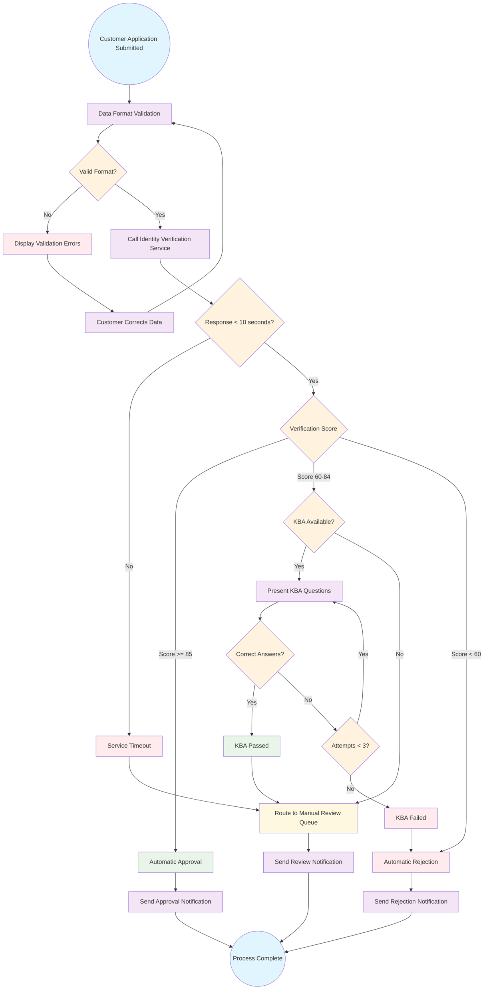

# Sample Basic Flowchart Solution

## Overview

This solution demonstrates a well-structured basic process flowchart for customer identity verification, created from the policy requirements. It shows the main process flow with clear decision points and error handling.

## The Generated Flowchart

## Quality Commentary

### What Makes This Flowchart Effective

**1. Clear Start and End Points**
- Starts with a specific trigger: "Customer Application Submitted"
- Ends at a clear completion state: "Process Complete"
- Shows that all paths lead to a definitive outcome

**2. Specific Decision Criteria**
- Uses exact thresholds from policy: "Score >= 85", "Score 60-84", "Score < 60"
- Includes timing requirements: "Response < 10 seconds"
- Shows attempt limits: "Attempts < 3"
- Decision labels are clear and actionable

**3. Comprehensive Error Handling**
- Validation errors allow customer to correct data and retry
- Service timeouts gracefully degrade to manual review
- KBA failures allow multiple attempts before final rejection
- All error paths lead to appropriate customer communication

**4. Policy Compliance**
- Implements the 4-step verification process exactly as described
- Enforces the 10-second API timeout requirement
- Includes the 3-attempt limit for KBA questions
- Routes edge cases to manual review as specified

**5. Visual Hierarchy**
- Color coding helps distinguish different types of nodes
- Consistent shape usage (diamonds for decisions, rectangles for processes)
- Logical flow from top to bottom makes it easy to follow
- Related processes are visually grouped

### Business Value Delivered

**For Stakeholders:**
- Visualizes complex policy in understandable format
- Shows all customer scenarios and outcomes
- Demonstrates compliance with regulatory requirements
- Enables discussion of process improvements

**For Development Teams:**
- Provides clear implementation guidance
- Shows all conditional logic and business rules
- Identifies external service dependencies
- Maps error handling requirements

**For Testing Teams:**
- Illustrates all paths that need test coverage
- Shows edge cases and error scenarios
- Identifies decision points that need validation
- Provides basis for UAT scenario creation

### Process Insights Revealed

**1. Customer Experience Focus**
- Multiple opportunities for customers to correct errors
- Clear communication at each decision point
- Graceful handling of system failures
- No dead ends - every path has an outcome

**2. Risk Mitigation**
- Automatic fallback to manual review when automation fails
- Multiple validation layers prevent invalid data progression
- Audit trail implicit in all decision points
- Compliance checks built into the main flow

**3. Operational Efficiency**
- Clear automation rules reduce manual work
- Defined escalation paths for edge cases
- SLA requirements embedded in process flow
- Parallel processing opportunities identified

## Areas for Enhancement

### Potential Improvements

**1. Document Processing Integration**
While this flowchart covers identity verification, the policy also mentions document authentication (OCR processing). A more complete version would include:
- Document upload and quality checks
- OCR processing and data extraction
- Document authenticity validation

**2. OFAC Screening Details**
The policy mentions OFAC sanctions screening, which could be explicitly shown:
- Dedicated OFAC screening step
- Positive match handling procedures
- Enhanced due diligence triggers

**3. Audit Trail Generation**
While implied, explicit audit logging could be shown:
- Decision point logging
- Customer interaction tracking
- Compliance evidence generation

### Usage in Different Contexts

**For Executive Presentations:**
- Focus on main flow, minimize error paths
- Emphasize compliance and risk mitigation
- Include timing and efficiency metrics

**For Technical Design:**
- Add system component details
- Include data flow annotations
- Show integration points more explicitly

**For Training Materials:**
- Annotate with policy section references
- Include common scenarios and examples
- Add troubleshooting guidance

## Integration with Other Artifacts

### Connection to Data Contracts
This flowchart informs data contract design by showing:
- **When data is collected:** At the initial validation step
- **What validation occurs:** Format checks, business rule validation
- **Where decisions are made:** Score thresholds, attempt tracking
- **What outcomes are recorded:** Approval/rejection status, audit trail

### Connection to UAT Testing
This flowchart provides the foundation for test case design:
- **Happy path scenarios:** Score >= 85 leading to auto-approval
- **Edge case scenarios:** Scores in 60-84 range requiring KBA
- **Error scenarios:** Validation failures, timeouts, KBA failures
- **Integration scenarios:** External service calls and responses

## Regulatory Compliance Evidence

### PATRIOT Act Compliance
- Identity verification through third-party service
- Document-based verification implied
- Customer identification procedures clearly defined

### Bank Secrecy Act Compliance
- Customer information collection at start
- Risk-based approach with score thresholds
- Manual review for unclear cases

### Audit Trail Requirements
- Every decision point creates audit evidence
- Customer interactions are tracked
- Service calls and responses are logged
- Outcomes are clearly documented

This basic flowchart provides a solid foundation for understanding the customer identity verification process while maintaining the appropriate level of detail for business stakeholder communication.