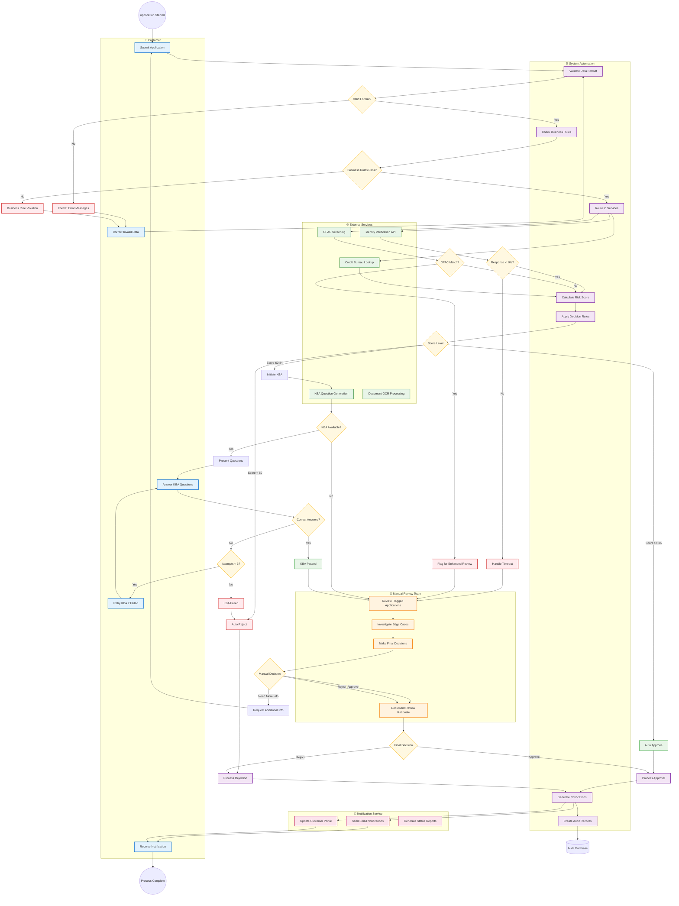

# Sample Swimlane Flowchart Solution

## Overview

This solution demonstrates an advanced swimlane flowchart that shows the customer identity verification process with clear actor responsibilities and handoffs. It builds upon the basic flowchart by organizing activities by who performs them.

## The Generated Swimlane Flowchart

## Quality Commentary

### What Makes This Swimlane Diagram Exceptional

**1. Clear Actor Separation**
- **Customer actions** are clearly distinguished from system processes
- **External service calls** are isolated to show integration dependencies
- **Manual review activities** are separated to show human intervention points
- **Notification processes** are organized to show communication workflows

**2. Realistic Handoffs**
- Shows exactly when control passes between actors
- Demonstrates parallel processing where multiple services work simultaneously
- Illustrates feedback loops where customers can correct and resubmit
- Maps escalation paths from automated to manual processes

**3. Comprehensive Error Handling**
- Validation errors route back to customer for correction
- Service timeouts gracefully escalate to manual review
- OFAC matches trigger immediate enhanced review procedures
- System failures don't leave customers in limbo

**4. Operational Insights**
- Shows where automation reduces manual work
- Identifies bottlenecks in manual review queue
- Demonstrates parallel service calls for efficiency
- Maps audit trail generation to system processes

### Business Value Delivered

**For Operations Teams:**
- Clear understanding of workload distribution
- Identification of manual review triggers and volumes
- Understanding of service dependencies and failure modes
- Visibility into customer communication touchpoints

**For Technical Teams:**
- Clear service integration requirements
- Understanding of data flow between systems
- Identification of async processing opportunities
- Service level agreement mapping to process steps

**For Compliance Teams:**
- Visibility into audit trail generation
- Understanding of regulatory checkpoint distribution
- Clear escalation procedures for compliance violations
- Documentation of review and approval authorities

### Process Design Insights

**1. Customer Experience Optimization**
- Multiple self-service recovery options before manual intervention
- Clear status communication at each handoff point
- Minimal customer effort required (only when systems cannot proceed)
- Fast path for straightforward applications (automation)

**2. Operational Efficiency**
- Automation handles majority of routine decisions
- Manual review reserved for genuine edge cases
- Parallel processing reduces total processing time
- Clear workload distribution prevents bottlenecks

**3. Risk Management**
- Multiple validation layers before external service calls
- Immediate escalation for high-risk scenarios (OFAC matches)
- Human oversight for borderline cases
- Complete audit trail across all actors

### Swimlane Design Rationale

**Customer Swimlane:**
- Focus on customer actions and experiences
- Shows what customers see and must do
- Emphasizes self-service capabilities
- Minimizes customer burden

**System Automation Swimlane:**
- Contains all automated decision logic
- Shows data processing and routing
- Includes business rule enforcement
- Manages integration orchestration

**External Services Swimlane:**
- Isolates third-party dependencies
- Shows service integration points
- Identifies potential failure points
- Maps data exchange requirements

**Manual Review Swimlane:**
- Shows human decision-making processes
- Includes investigation and research activities
- Documents approval authorities
- Provides escalation procedures

**Notification Swimlane:**
- Centralizes customer communication
- Shows multi-channel notification (email, portal)
- Includes status tracking and reporting
- Maps audit and compliance reporting

## Areas for Enhancement

### Additional Swimlanes to Consider

**1. Compliance/Audit Swimlane**
- BSA/AML monitoring activities
- Regulatory reporting generation
- Audit evidence collection
- Risk assessment procedures

**2. Document Processing Swimlane**
- Document upload and validation
- OCR processing and quality checks
- Document storage and retention
- Identity document verification

**3. Security/Fraud Swimlane**
- Fraud detection algorithms
- Security monitoring and alerting
- Incident response procedures
- Enhanced due diligence processes

### Process Improvements Identified

**1. Parallel Processing Opportunities**
- Identity verification and OFAC screening can run simultaneously
- Document processing can occur while identity verification runs
- Notification preparation can start before final decision

**2. Cache and Optimization Opportunities**
- Previous KBA responses can inform question selection
- Customer data can be pre-validated before service calls
- Risk scores can be cached for similar customer profiles

**3. Customer Experience Enhancements**
- Real-time status updates during processing
- Estimated completion times based on current queue
- Proactive communication about next steps

## Integration with Technical Architecture

### API Design Implications
This swimlane diagram informs API design by showing:
- **Service boundaries:** Each swimlane represents a potential microservice
- **Data flow:** What information passes between actors
- **Integration patterns:** Synchronous vs. asynchronous communication needs
- **Error handling:** How failures propagate and are handled

### Database Design Considerations
The diagram reveals data storage needs:
- **Customer data:** Personal information, application status
- **Verification results:** Scores, service responses, decisions
- **Audit trail:** Every decision point and handoff
- **Document storage:** Identity documents, supporting materials

### Monitoring and Alerting Requirements
Each swimlane suggests monitoring needs:
- **Customer:** Abandonment rates, error frequencies
- **System:** Processing times, error rates, throughput
- **External:** Service availability, response times, error rates
- **Manual:** Queue depths, processing times, decision patterns
- **Notification:** Delivery rates, open rates, response times

## Usage for Different Audiences

### For Executive Stakeholders
- Focus on customer experience (top swimlane)
- Highlight automation benefits (system swimlane efficiency)
- Emphasize compliance coverage (manual review oversight)
- Show risk mitigation (multiple validation layers)

### For Operations Management
- Focus on manual review swimlane workloads
- Highlight automation reducing manual burden
- Show clear escalation procedures
- Identify capacity planning needs

### For Development Teams
- Use as service boundary definition
- Map integration requirements
- Identify data flow needs
- Plan error handling strategies

### For Quality Assurance
- Test scenarios for each swimlane
- Validate handoff procedures
- Test error and recovery paths
- Verify audit trail completeness

This swimlane flowchart provides a comprehensive view of the customer onboarding process that enables different stakeholders to understand their role in the overall workflow while seeing how their activities integrate with others.