# Mermaid Flowchart Template Guide

## What is Mermaid?

Mermaid is a JavaScript-based diagramming tool that renders diagrams from text descriptions. It's ideal for creating flowcharts, sequence diagrams, and other process visualizations that can be version-controlled and easily updated.

## Why Use Mermaid for Process Documentation?

- **Version Control Friendly:** Text-based diagrams can be tracked in Git
- **Maintainable:** Easy to update as processes change
- **Consistent Styling:** Automatic formatting ensures professional appearance
- **Tool Integration:** Supported in GitHub, GitLab, Notion, and many documentation platforms
- **Collaborative:** Multiple analysts can edit the same diagram

## Basic Mermaid Syntax

### Flowchart Declaration
Every Mermaid flowchart starts with a direction declaration:

```mermaid
flowchart TD
    %% TD = Top Down, LR = Left Right, RL = Right Left, BT = Bottom Top
```

### Node Shapes Reference

Different shapes convey different meanings in process flows:

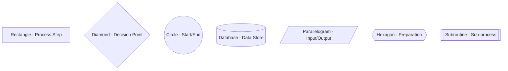

### Connecting Nodes

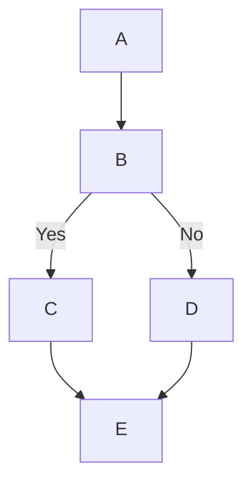

### Labels and Conditions

Use pipe symbols to add labels to connections:

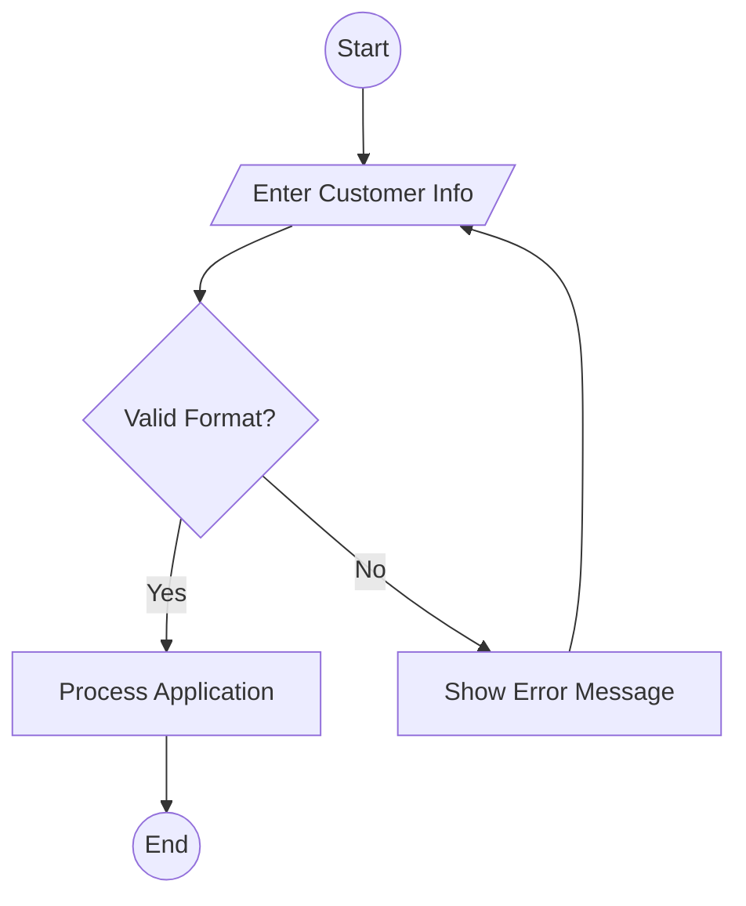

## Decision Points Best Practices

### Clear Yes/No Paths
Always label decision outputs clearly:

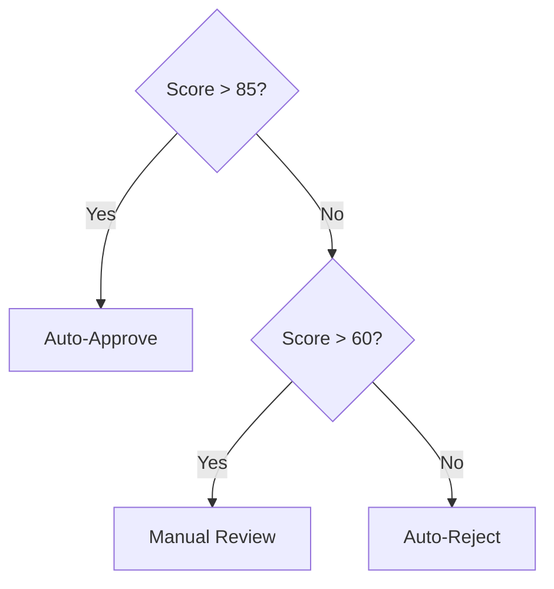

### Multiple Conditions
For complex decisions, use descriptive labels:

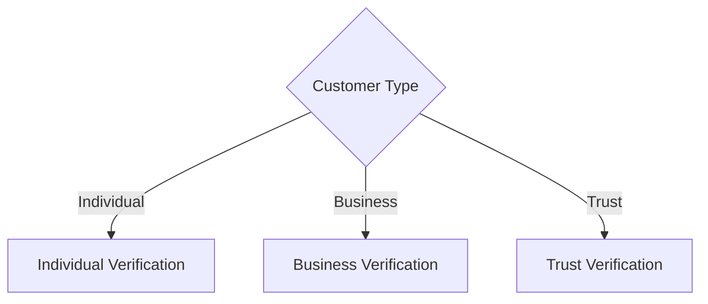

## Error Handling Patterns

### Error Recovery Loops
Show how errors are handled and recovery paths:

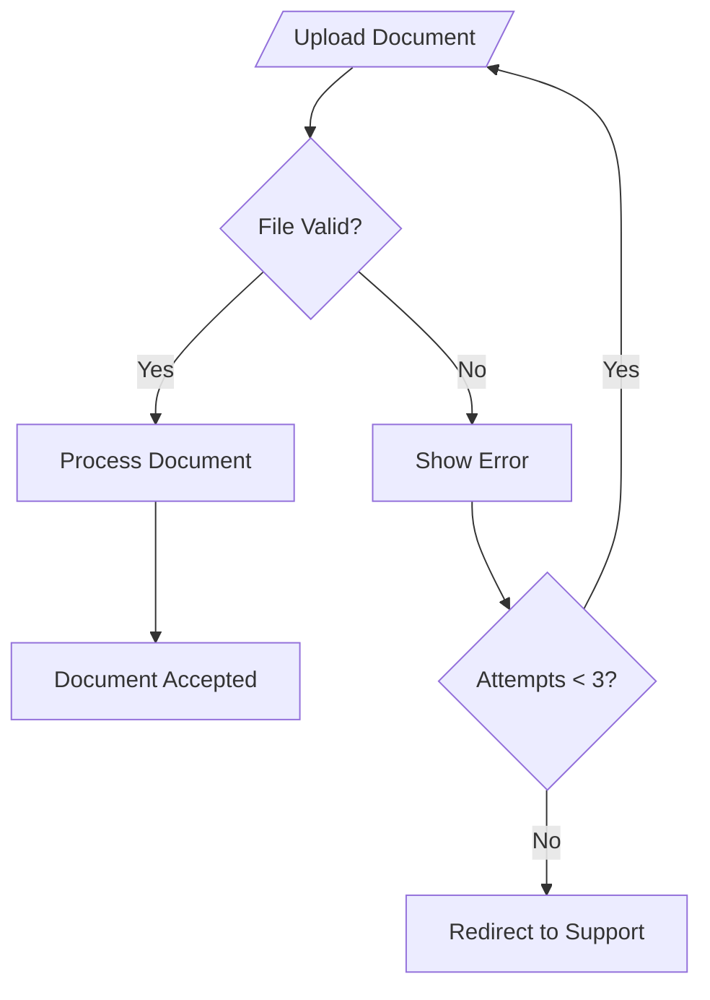

### Timeout Handling
Include timeout scenarios:

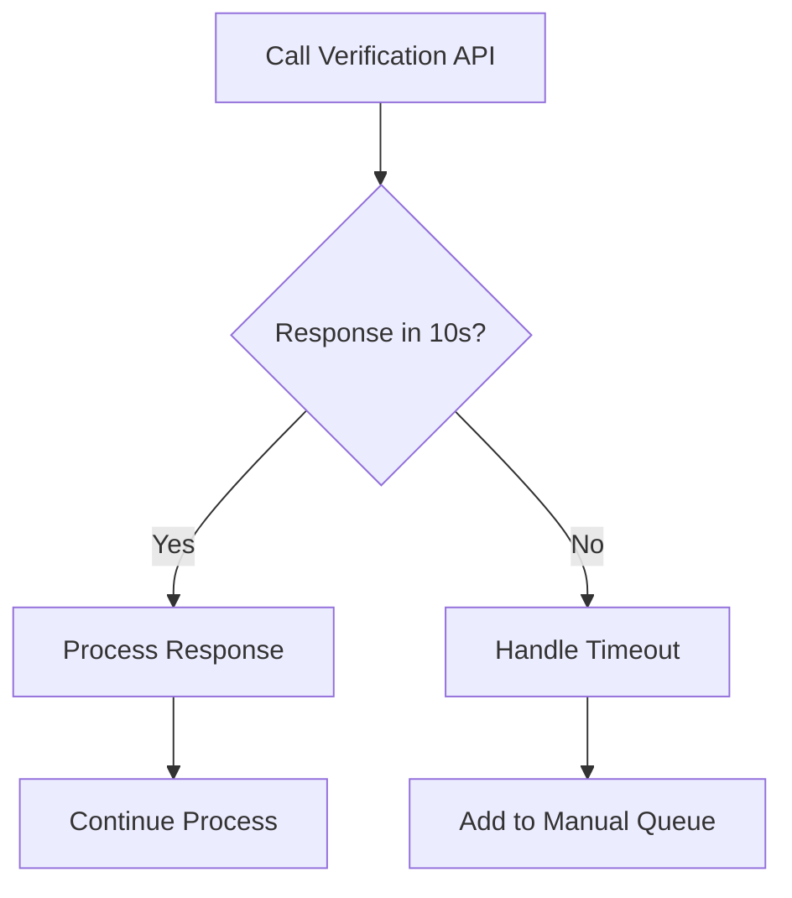

## Swimlane Diagrams

Use subgraphs to show different actors or systems:

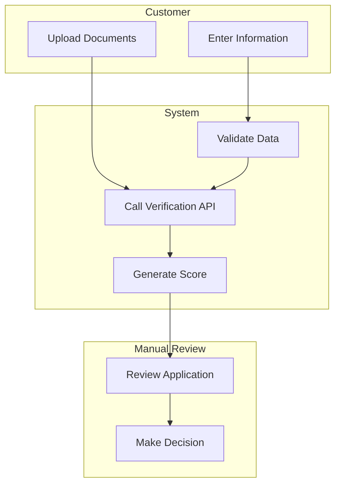

## Styling and Colors

Add visual hierarchy with styling:

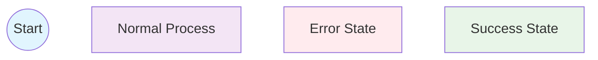

## Complete Example: Simple Verification Flow

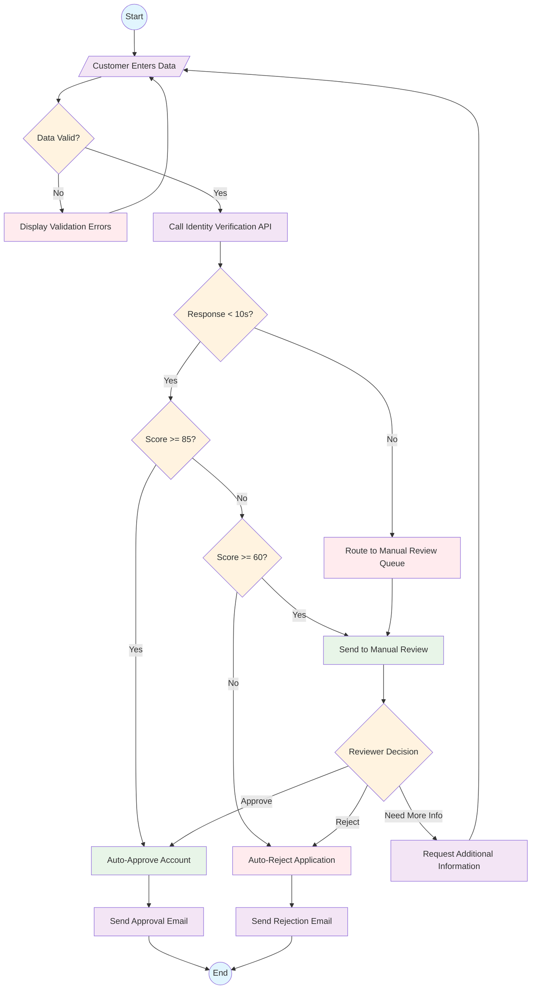

## Advanced Example: Swimlane with Error Handling

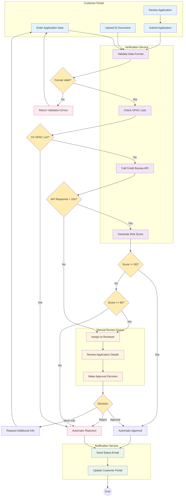

## Tips for Using Mermaid with Copilot

1. **Start Simple:** Begin with basic flowcharts and add complexity incrementally
2. **Use Descriptive Node Names:** This helps Copilot understand your intent
3. **Include Error Paths:** Always ask Copilot to include error handling scenarios
4. **Request Styling:** Ask Copilot to add appropriate CSS classes for visual clarity
5. **Validate Syntax:** Copy-paste generated Mermaid code into a validator to check for errors

## Common Mermaid Syntax Errors to Avoid

- **Missing Direction:** Always start with `flowchart TD` or similar
- **Invalid Characters:** Avoid special characters in node IDs
- **Unclosed Brackets:** Ensure all node shapes are properly closed
- **Missing Arrows:** Every connection needs `-->` or similar
- **Duplicate IDs:** Each node must have a unique identifier

## Testing Your Mermaid Diagrams

Use the online Mermaid Live Editor (https://mermaid.live) to test your generated diagrams before committing to documentation.