# Mermaid Reference Guide for Business Analysts

## Overview

Mermaid is a markdown-based diagramming tool that allows business analysts to create clear, maintainable process flows, sequence diagrams, and other visual documentation. This guide focuses on the diagram types most useful for analyst work: flowcharts and sequence diagrams.

## Flowchart Basics

### Basic Syntax
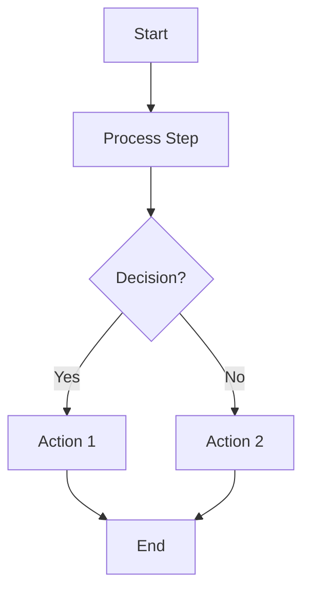

### Direction Options
- `TD` or `TB`: Top to Bottom (default)
- `BT`: Bottom to Top
- `LR`: Left to Right
- `RL`: Right to Left

### Basic Structure
```mermaid
flowchart [direction]
    [node1][text] --> [node2][text]
```

---

## Node Shapes and Types

### Standard Shapes
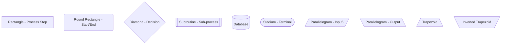

### When to Use Each Shape

**Rectangle `[text]`** - Standard process steps
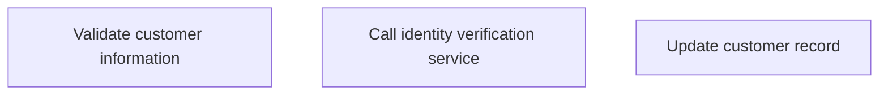

**Round Rectangle `(text)`** - Start and end points
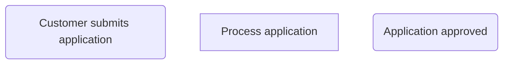

**Diamond `{text}`** - Decision points
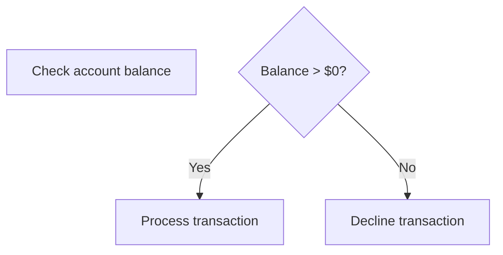

**Subroutine `[[text]]`** - Complex sub-processes
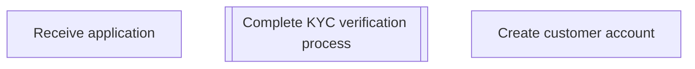

**Database `[(text)]`** - Data storage or retrieval
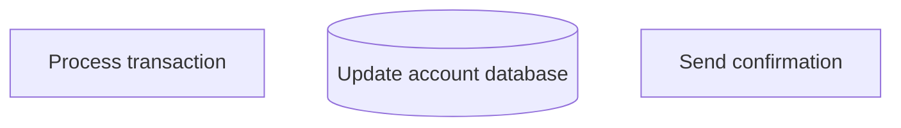

---

## Connectors and Flow Direction

### Basic Connectors
```mermaid
flowchart TD
    A --> B         %% Arrow
    C --- D         %% Line (no arrow)
    E -.-> F        %% Dotted arrow
    G -.- H         %% Dotted line
    I ==> J         %% Thick arrow
    K === L         %% Thick line
```

### Labeled Connectors
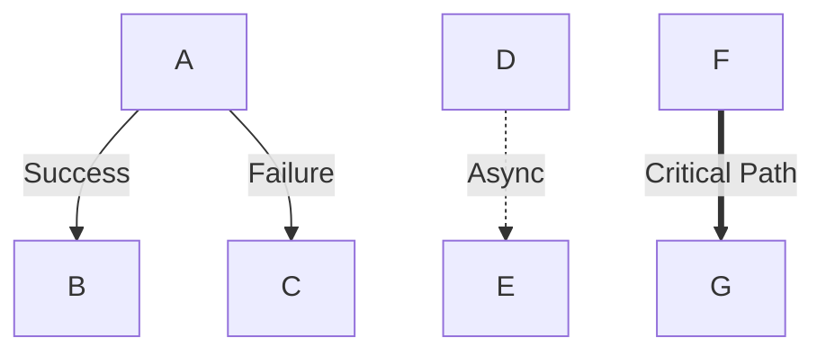

### Multi-directional Flow
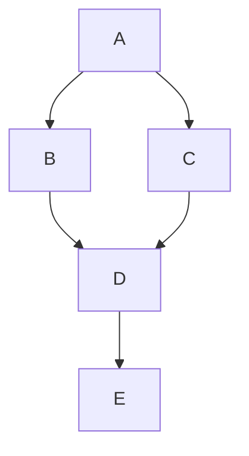

---

## Decision Points and Conditions

### Simple Decision
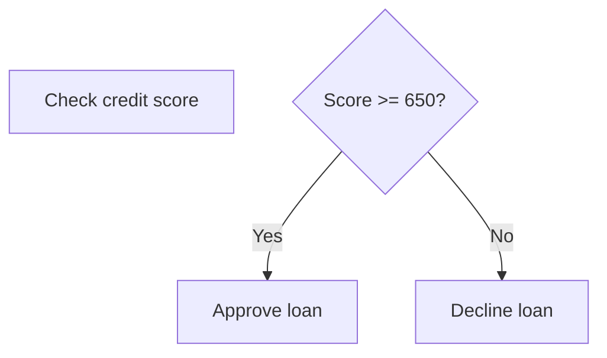

### Multiple Conditions
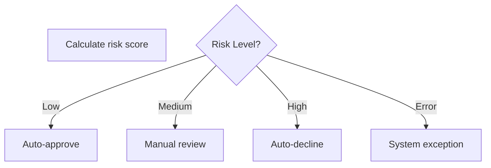

### Complex Decision Logic
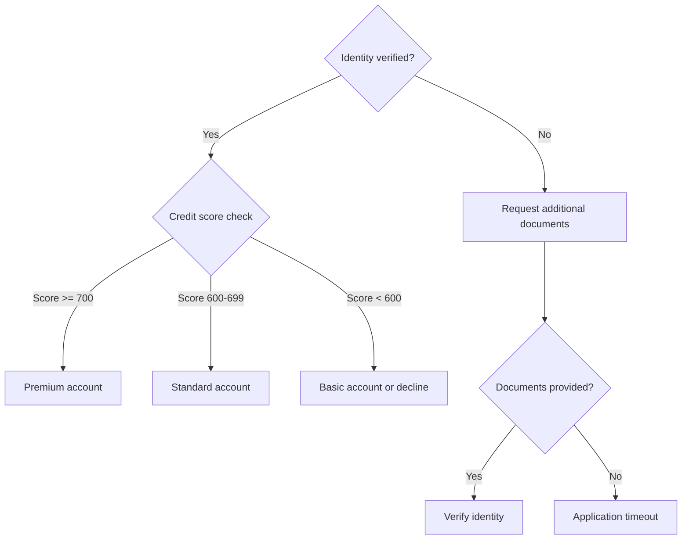

---

## Swimlanes and Subgraphs

### Basic Swimlanes
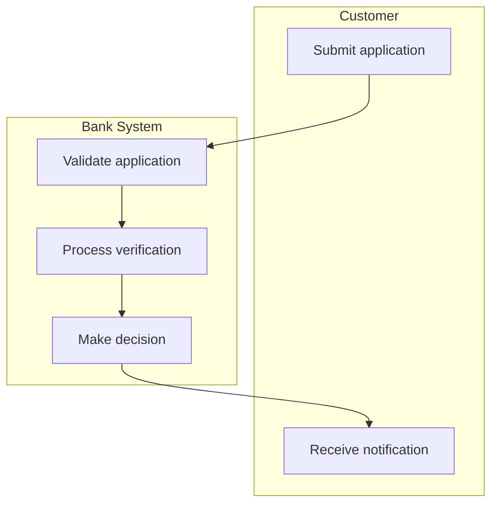

### Multi-Actor Process Flow
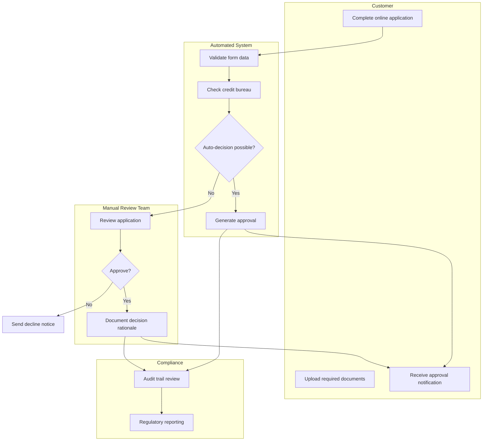

### Department-Based Swimlanes
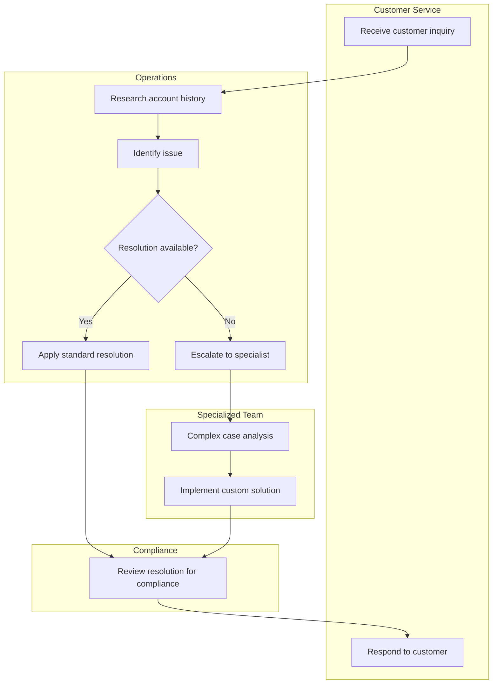

---

## Error Handling and Exception Flows

### Timeout Handling
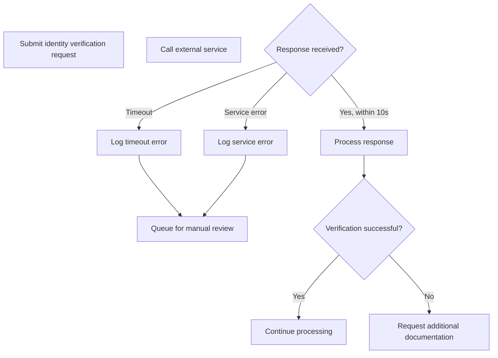

### Retry Logic
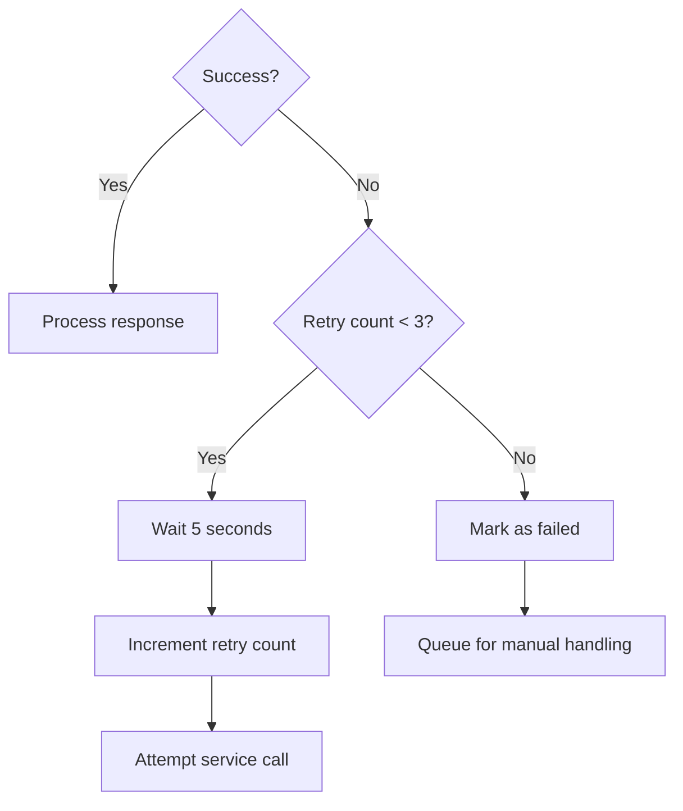

### Multiple Error Paths
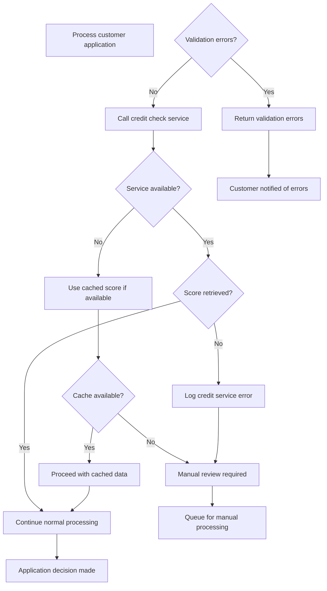

---

## Styling and Appearance

### Node Styling
```mermaid
flowchart TD
    A[Normal Step]
    B[Critical Step]
    C[Warning Step]
    D[Success Step]
    
    classDef critical fill:#ff6b6b,stroke:#d63031,stroke-width:3px,color:#fff
    classDef warning fill:#fdcb6e,stroke:#e17055,stroke-width:2px
    classDef success fill:#00b894,stroke:#00a085,stroke-width:2px,color:#fff
    
    class B critical
    class C warning
    class D success
```

### Custom Colors for Process Types
```mermaid
flowchart TD
    A[Customer Action]
    B[System Process]
    C[Manual Review]
    D[External Service]
    E[Database Operation]
    
    classDef customer fill:#74b9ff,stroke:#0984e3,stroke-width:2px,color:#fff
    classDef system fill:#a29bfe,stroke:#6c5ce7,stroke-width:2px,color:#fff
    classDef manual fill:#fd79a8,stroke:#e84393,stroke-width:2px,color:#fff
    classDef external fill:#fdcb6e,stroke:#e17055,stroke-width:2px
    classDef database fill:#00b894,stroke:#00a085,stroke-width:2px,color:#fff
    
    class A customer
    class B system
    class C manual
    class D external
    class E database
```

---

## Sequence Diagrams

### Basic Sequence Diagram
```mermaid
sequenceDiagram
    participant C as Customer
    participant W as Web App
    participant S as Auth Service
    participant D as Database
    
    C->>W: Enter credentials
    W->>S: Validate credentials
    S->>D: Check user record
    D-->>S: User data
    S-->>W: Validation result
    W-->>C: Login success/failure
```

### Complex Interaction Flow
```mermaid
sequenceDiagram
    participant Customer
    participant WebApp as Web Application
    participant Gateway as API Gateway
    participant AuthSvc as Authentication Service
    participant CreditSvc as Credit Service
    participant Database
    participant EmailSvc as Email Service
    
    Customer->>WebApp: Submit loan application
    WebApp->>Gateway: POST /applications
    Gateway->>AuthSvc: Validate session
    AuthSvc-->>Gateway: Session valid
    
    Gateway->>Database: Save application
    Database-->>Gateway: Application saved (ID: 12345)
    
    Gateway->>CreditSvc: Request credit check
    CreditSvc->>CreditSvc: Process credit inquiry
    CreditSvc-->>Gateway: Credit score: 720
    
    Gateway->>Database: Update application with score
    Gateway->>EmailSvc: Send confirmation email
    EmailSvc-->>Gateway: Email queued
    
    Gateway-->>WebApp: Application received (ID: 12345)
    WebApp-->>Customer: Confirmation page displayed
    
    Note over EmailSvc: Email sent asynchronously
    EmailSvc->>Customer: Confirmation email delivered
```

### Error Handling in Sequence Diagrams
```mermaid
sequenceDiagram
    participant Customer
    participant WebApp as Web Application
    participant PaymentSvc as Payment Service
    participant Bank as Bank API
    
    Customer->>WebApp: Submit payment
    WebApp->>PaymentSvc: Process payment
    PaymentSvc->>Bank: Charge account
    
    alt Payment successful
        Bank-->>PaymentSvc: Success
        PaymentSvc-->>WebApp: Payment confirmed
        WebApp-->>Customer: Success message
    else Insufficient funds
        Bank-->>PaymentSvc: Insufficient funds
        PaymentSvc-->>WebApp: Payment failed
        WebApp-->>Customer: Error: Insufficient funds
    else Service timeout
        Bank--xPaymentSvc: Timeout
        PaymentSvc->>PaymentSvc: Log timeout
        PaymentSvc-->>WebApp: Service unavailable
        WebApp-->>Customer: Error: Please try again
    end
```

---

## Analyst-Specific Examples

### Example 1: Customer Onboarding Process
```mermaid
flowchart TD
    subgraph "Customer Journey"
        A(Customer starts application)
        L[Receive welcome email]
        M[Access new account]
    end
    
    subgraph "Application Processing"
        B[Collect basic information]
        C[Upload identity documents]
        D{Form validation}
        E[Store application data]
    end
    
    subgraph "Verification Services"
        F[[Identity verification]]
        G[[Credit check]]
        H[[OFAC screening]]
    end
    
    subgraph "Decision Engine"
        I{Auto-decision possible?}
        J[Calculate risk score]
        K{Approve?}
    end
    
    subgraph "Manual Review"
        N[Assign to reviewer]
        O[Review documents]
        P{Manual approval?}
    end
    
    A --> B
    B --> C
    C --> D
    D -->|Valid| E
    D -->|Invalid| Q[Return errors to customer]
    Q --> B
    
    E --> F
    E --> G
    E --> H
    
    F --> I
    G --> I
    H --> I
    
    I -->|Yes| J
    I -->|No| N
    
    J --> K
    K -->|Yes| L
    K -->|No| R[Send decline notice]
    
    N --> O
    O --> P
    P -->|Yes| L
    P -->|No| R
    
    L --> M
    
    classDef customer fill:#74b9ff,stroke:#0984e3,stroke-width:2px,color:#fff
    classDef system fill:#a29bfe,stroke:#6c5ce7,stroke-width:2px,color:#fff
    classDef external fill:#fdcb6e,stroke:#e17055,stroke-width:2px
    classDef manual fill:#fd79a8,stroke:#e84393,stroke-width:2px,color:#fff
    classDef decision fill:#00b894,stroke:#00a085,stroke-width:3px,color:#fff
    
    class A,L,M customer
    class B,C,E,J system
    class F,G,H external
    class N,O manual
    class D,I,K,P decision
```

### Example 2: Payment Processing Data Flow
```mermaid
flowchart LR
    subgraph "Customer Interface"
        A[Customer initiates payment]
        K[Payment confirmation displayed]
    end
    
    subgraph "Application Layer"
        B[Payment form validation]
        C[Payment service call]
        J[Update UI with result]
    end
    
    subgraph "Business Logic"
        D[Validate account balance]
        E[Check daily limits]
        F[Create transaction record]
        I[Update account balance]
    end
    
    subgraph "External Services"
        G[Bank network processing]
        H[Fraud detection check]
    end
    
    subgraph "Data Storage"
        L[(Transaction database)]
        M[(Account database)]
        N[(Audit log)]
    end
    
    A --> B
    B --> C
    C --> D
    D --> E
    E --> F
    F --> G
    F --> H
    G --> I
    H --> I
    I --> J
    J --> K
    
    F --> L
    I --> M
    G --> N
    H --> N
```

### Example 3: Alert System Decision Tree
```mermaid
flowchart TD
    A[Transaction processed]
    B[Check if customer has alerts enabled]
    C{Alerts enabled?}
    
    C -->|No| D[No action needed]
    C -->|Yes| E[Calculate new balance]
    
    E --> F{Balance below threshold?}
    F -->|No| D
    F -->|Yes| G[Check customer preferences]
    
    G --> H{Email enabled?}
    G --> I{SMS enabled?}
    G --> J{Push notification enabled?}
    
    H -->|Yes| K[Send email alert]
    I -->|Yes| L[Send SMS alert]
    J -->|Yes| M[Send push notification]
    
    K --> N[Log email sent]
    L --> O[Log SMS sent]
    M --> P[Log push notification sent]
    
    N --> Q[Check delivery status]
    O --> Q
    P --> Q
    
    Q --> R{All alerts delivered?}
    R -->|Yes| S[Mark alert as successful]
    R -->|No| T[Retry failed deliveries]
    
    T --> U{Retry successful?}
    U -->|Yes| S
    U -->|No| V[Queue for manual follow-up]
    
    classDef process fill:#74b9ff,stroke:#0984e3,stroke-width:2px,color:#fff
    classDef decision fill:#00b894,stroke:#00a085,stroke-width:2px,color:#fff
    classDef action fill:#fdcb6e,stroke:#e17055,stroke-width:2px
    classDef terminal fill:#fd79a8,stroke:#e84393,stroke-width:2px,color:#fff
    
    class A,B,E,G,Q process
    class C,F,H,I,J,R,U decision
    class K,L,M,N,O,P,T action
    class D,S,V terminal
```

---

## Best Practices for Analysts

### 1. Keep It Simple
- Use consistent shapes and colors
- Avoid crossing lines when possible
- Group related processes in subgraphs
- Use clear, descriptive labels

### 2. Focus on Business Logic
```mermaid
flowchart TD
    A[Customer requests account closure]
    B{Outstanding balance?}
    B -->|Yes| C[Customer must pay balance]
    B -->|No| D{Pending transactions?}
    D -->|Yes| E[Wait for transactions to clear]
    D -->|No| F[Close account immediately]
    
    C --> G[Payment received]
    G --> D
    E --> H[All transactions cleared]
    H --> F
    F --> I[Send closure confirmation]
```

### 3. Document Exception Paths
Always include error handling and edge cases in your flowcharts.

### 4. Use Swimlanes for Multi-Actor Processes
When multiple departments or systems are involved, swimlanes clarify responsibilities.

### 5. Include Compliance Checkpoints
```mermaid
flowchart TD
    A[Process high-value transaction]
    B{Amount > $10,000?}
    B -->|Yes| C[Generate CTR report]
    B -->|No| D[Standard processing]
    C --> E[Submit to FinCEN]
    C --> D
    D --> F[Complete transaction]
```

---

## Quick Reference

### Common Node Types
- `[text]` - Process step
- `(text)` - Start/end
- `{text}` - Decision
- `[[text]]` - Subprocess
- `[(text)]` - Database

### Common Connectors
- `-->` - Arrow
- `-.->` - Dotted arrow  
- `==>` - Thick arrow
- `-->|label|` - Labeled arrow

### Styling Classes
```mermaid
classDef important fill:#ff6b6b,stroke:#d63031,stroke-width:3px,color:#fff
classDef process fill:#74b9ff,stroke:#0984e3,stroke-width:2px,color:#fff
classDef decision fill:#00b894,stroke:#00a085,stroke-width:2px,color:#fff
```

This reference guide provides the foundation for creating clear, professional process documentation that effectively communicates business requirements and system behavior to both technical and non-technical stakeholders.