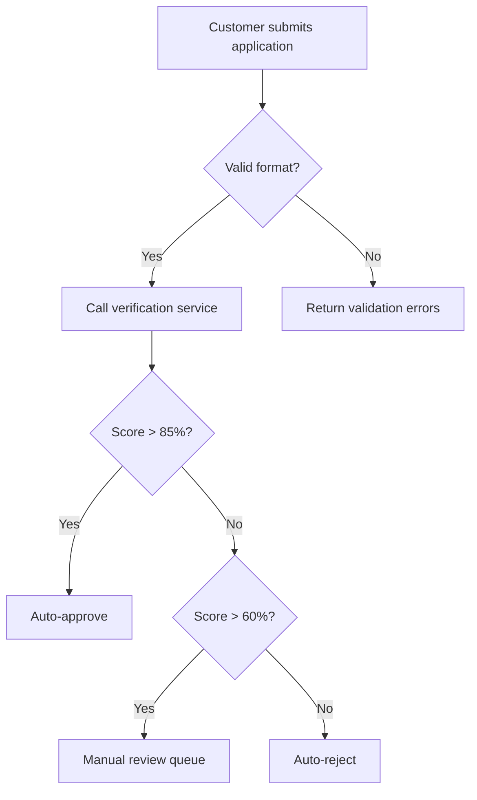
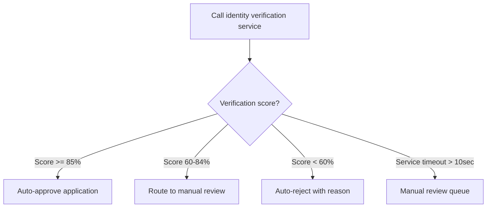

# Comprehensive Prompt Pattern Guide for GitHub Copilot

## Overview

This guide provides a structured approach to crafting effective prompts for GitHub Copilot when working as a business analyst. The five-part prompt pattern ensures consistent, high-quality output across different analyst tasks.

## The Five-Part Prompt Pattern

Every effective Copilot prompt should include these five elements:

### 1. Role
Tell Copilot what role to assume and the context of your work.

### 2. Inputs
Provide the source material, data, or context Copilot needs.

### 3. Format
Specify the exact structure and format of the desired output.

### 4. Constraints
Add requirements, boundaries, and rules that must be followed.

### 5. Examples
Show what good output looks like with concrete examples.

---

## Part 1: Role Definition

### Good Role Statements
```
You are a senior business analyst in a regulated financial services environment.
```

```
You are an experienced systems analyst working on API documentation for development teams.
```

```
You are a product owner preparing user stories for sprint planning in an agile environment.
```

### Why Role Matters
- Sets the professional context and expertise level
- Influences the vocabulary and tone of output
- Helps Copilot understand industry-specific requirements

### Bad vs Good Examples

❌ **Bad:**
```
Help me with requirements.
```

✅ **Good:**
```
You are a business analyst at a bank preparing requirements for a customer onboarding system that must comply with KYC regulations.
```

---

## Part 2: Input Specification

### Types of Inputs
- **Meeting notes** (sanitized)
- **Policy documents** (excerpts)
- **Existing artifacts** (stories, requirements)
- **Stakeholder feedback**
- **Technical specifications**

### Input Best Practices

1. **Sanitize First**
   - Remove all PII before pasting
   - Replace with synthetic data
   - Use generic examples

2. **Provide Context**
   - Date of meeting/document
   - Attendees or stakeholders
   - Purpose of the original artifact

3. **Highlight Key Elements**
   - Mark important sections
   - Call out ambiguities
   - Note compliance requirements

### Example Input Formatting
```
Based on these stakeholder notes from our October 15 product discovery session:

[SANITIZED MEETING NOTES]
Attendees: Product Owner, Dev Lead, Compliance Rep
Topic: Customer alert preferences feature

Key requirements discussed:
- Real-time balance alerts
- Multiple notification channels
- Regulatory compliance needs
```

---

## Part 3: Format Requirements

### Common Output Formats for Analysts

#### User Stories
```
Format each story as:
- User story: As a [role], I want [capability], so that [benefit]
- 2-3 acceptance criteria using Given/When/Then
- Priority: High/Medium/Low
- Complexity estimate: Small/Medium/Large
```

#### Epics
```
For each epic, provide:
- Epic title: [Concise, business-focused]
- Description: [2-3 sentences]
- Business value: [Problem + expected outcome + metrics]
- Key assumptions: [2-3 assumptions]
- Story themes: [3-5 high-level areas]
```

#### Process Flows
```
Output as Mermaid flowchart with:
- Start/end nodes as circles
- Process steps as rectangles
- Decision points as diamonds
- Include error handling paths
- Add swimlanes for different actors
```

#### Data Contracts
```
Generate OpenAPI YAML format with:
- Required and optional fields clearly marked
- Data type specifications (string, integer, boolean, array)
- Validation rules (minLength, maxLength, pattern, minimum, maximum)
- Examples for each field
- Descriptions explaining business purpose
```

---

## Part 4: Constraints and Boundaries

### Universal Constraints

#### Compliance Requirements
```
Constraints:
- This is for a regulated financial environment
- Must comply with FINRA Rule 4512 for customer notifications
- Include audit trail considerations
- Flag any PII handling requirements
```

#### Quality Standards
```
Constraints:
- Each story must meet INVEST criteria
- Acceptance criteria must be testable and unambiguous
- Include negative/edge cases
- No implementation details (focus on WHAT, not HOW)
```

#### Technical Boundaries
```
Constraints:
- Integration points limited to existing APIs
- Response time must be under 5 seconds
- Must work with legacy core banking system
- Mobile app changes require 24-hour lead time
```

### Domain-Specific Constraints

#### For Financial Services
- Regulatory compliance (SEC, FINRA, FDIC)
- Data privacy (PII, PCI DSS)
- Audit requirements
- Risk management considerations

#### For Healthcare
- HIPAA compliance
- Patient privacy
- Medical device regulations
- Safety requirements

#### For Government
- Security clearance levels
- FISMA compliance
- Public records requirements
- Accessibility (Section 508)

---

## Part 5: Examples and Templates

### Why Examples Matter
- Show the quality and detail level expected
- Demonstrate formatting preferences
- Reduce ambiguity in requirements
- Provide a concrete success model

### Example Structures

#### For User Stories
```
Example of a well-formed story:

**US-001: Customer Sets Alert Threshold**
As a retail banking customer
I want to set a custom dollar threshold for low balance alerts
So that I can avoid overdraft fees and manage my cash flow proactively

**Acceptance Criteria:**
AC1: Given I'm logged into my account
     When I navigate to alert preferences
     Then I can set a threshold between $0-$1000

AC2: Given I enter a valid threshold amount
     When I save my preferences
     Then the system confirms the setting is active

AC3: Given my balance drops below my threshold
     When the system processes the balance update
     Then I receive an alert within 2 minutes

**Priority:** High
**Complexity:** Small
```

#### For Process Flows
```
Include decision points like this:


```

---

## Complete Prompt Examples

### Example 1: Epic Generation from Meeting Notes

```
You are a senior business analyst in a regulated financial services environment working on customer experience improvements.

Review these sanitized stakeholder notes from our October 15 product discovery session:

[Meeting notes show discussions about automated account alerts, multiple delivery channels, threshold customization, compliance requirements for FINRA Rule 4512, integration with legacy systems, and business goals of reducing overdraft fees by 30%]

Generate 2-3 epics that capture the high-level business capabilities discussed.

For each epic, provide:
- Epic Title: [Concise, business-focused]
- Description: [2-3 sentences describing the capability]
- Business Value: [Problem statement + expected outcome + success metrics]
- Key Assumptions: [2-3 assumptions requiring validation]
- High-level Story Themes: [3-5 areas that will become stories]

Constraints:
- Each epic should represent 2-4 weeks of development work
- Focus on customer-facing capabilities, not technical implementation
- Include compliance considerations for financial services
- Identify dependencies on external systems
- Flag any audit or regulatory requirements

Example of a well-formed epic:

**Epic: Customer Balance Alert Management**
Description: Enable customers to configure and receive automated alerts when their account balance crosses defined thresholds, helping them avoid overdrafts and manage cash flow proactively.

Business Value:
- Problem: 30% of customers incur avoidable overdraft fees due to lack of awareness
- Expected Outcome: Reduce overdraft incidents by 25-30% within 6 months
- Success Metrics: Customer satisfaction score +15%, overdraft revenue impact -$2M annually

Key Assumptions:
- Real-time balance data is available from core banking system
- Notification service can handle increased volume (current limit: 100/minute)
- Customer preference data can be stored in existing profile database

Story Themes:
1. Threshold configuration and management
2. Multi-channel alert delivery (email, SMS, push)
3. Alert history and audit trail
4. Account type-specific rules
5. Compliance with notification regulations
```

### Example 2: Story Splitting with INVEST

```
You are a business analyst ensuring user stories meet INVEST criteria before sprint planning.

Take this epic and split it into 3-5 user stories:

**Epic: Customer Balance Alert Management**
[Full epic description from previous example]

For each story, provide:
- User story in format: As a [role], I want [capability], so that [benefit]
- 2-3 brief acceptance criteria (detailed Gherkin will come later)
- Priority: High/Medium/Low based on business value and dependencies
- Complexity: Small/Medium/Large (Small = 1-3 days, Medium = 3-5 days, Large = 5+ days)
- Dependencies: Any technical or external dependencies

Constraints:
- Each story must be Independent (deliverable separately)
- Each story must be Valuable (delivers customer/business benefit)
- Each story must be Estimable (team can size the work)
- Each story must be Small (completable in one sprint)
- Each story must be Testable (clear success criteria)
- Focus on customer capabilities, not technical implementation
- Consider the sequence: what must be built first?

Example of a well-formed story:

**US-002: Customer Views Alert History**
As a retail banking customer
I want to view my alert history for the past 90 days
So that I can track my account activity and verify alerts were sent

**Acceptance Criteria:**
AC1: Customer can access alert history from account dashboard
AC2: History shows date, time, alert type, and delivery status
AC3: History is filterable by date range and alert type

**Priority:** Medium
**Complexity:** Small
**Dependencies:** Must have US-001 (threshold setting) completed first
```

### Example 3: Gherkin Scenario Generation

```
You are a business analyst creating detailed acceptance criteria for development and QA teams.

Convert this user story into 2-3 Gherkin scenarios covering positive and negative cases:

**US-001: Customer Sets Alert Threshold**
As a retail banking customer
I want to set a custom dollar threshold for low balance alerts
So that I can avoid overdraft fees and manage my cash flow

**Brief AC:**
- Customer can set threshold between $0-$1000
- System validates threshold on save
- Threshold is persisted to customer profile

Generate scenarios in this format:
```gherkin
Scenario: [Descriptive name]
  Given [specific precondition with concrete data]
  When [specific action with concrete data]
  Then [specific, measurable outcome]
```

Requirements:
- Use concrete, realistic data in scenarios (not variables)
- Cover the happy path (valid threshold setting)
- Cover validation cases (invalid amounts, out of range)
- Cover edge cases (boundary values, system errors)
- Make each scenario independently testable
- Include specific data values, not placeholders

Example format:
```gherkin
Scenario: Customer sets valid threshold within allowed range
  Given I am logged into my account as customer ID "CUST-12345"
  And my current alert threshold is not set
  When I navigate to "Alert Preferences" 
  And I enter "$250.00" in the threshold field
  And I click "Save Preferences"
  Then I see confirmation message "Alert threshold saved successfully"
  And my threshold displays as "$250.00" in the preferences
  And the system logs the preference change with timestamp
```
```

### Example 4: Data Contract Generation

```
You are a systems analyst documenting API contracts for development teams working on customer onboarding.

Based on this business policy excerpt:

[Policy states: Customer application requires legal name, DOB, SSN, address, phone, email, government ID type and number, plus automated verification score and manual review flag]

Generate an OpenAPI schema in YAML format for a Customer object.

Include:
- All required fields based on the policy
- Appropriate data types (string, integer, boolean, array, object)
- Validation rules (required, minLength, maxLength, pattern, minimum, maximum)
- Business-appropriate formats (date, email, uuid, phone)
- Realistic examples for each field
- Clear descriptions explaining business purpose

Format requirements:
- Valid YAML syntax
- OpenAPI 3.0 specification format
- Properties section with all fields
- Required array listing mandatory fields
- Example section with realistic synthetic data

Example structure:
```yaml
CustomerApplication:
  type: object
  required:
    - legalName
    - dateOfBirth
    - socialSecurityNumber
    - primaryAddress
    - emailAddress
  properties:
    legalName:
      type: string
      minLength: 2
      maxLength: 100
      pattern: "^[a-zA-Z\\s\\-']+$"
      description: "Customer's full legal name as it appears on government ID"
      example: "Alice Marie Anderson"
    dateOfBirth:
      type: string
      format: date
      description: "Customer's date of birth for age verification (must be 18+)"
      example: "1990-03-15"
```

Constraints:
- Use realistic but synthetic example data
- Follow financial services data patterns
- Include compliance validation rules
- Consider audit and regulatory requirements
- No real PII in examples
```

### Example 5: Process Flow Documentation

```
You are a business analyst creating process documentation for compliance and development teams.

Based on this customer onboarding policy section:

[Policy describes multi-step verification: application validation, identity service call, document verification, decision rules for auto-approve/manual review/reject, and error handling procedures]

Create a Mermaid flowchart showing the complete process flow including:
- All decision points with specific criteria
- Error handling and timeout scenarios
- Different paths (auto-approve, manual review, reject)
- Compliance checkpoints
- System integrations

Format as:
```mermaid
flowchart TD
    [Use proper Mermaid syntax]
```

Requirements:
- Start/end nodes as circles
- Process steps as rectangles  
- Decision points as diamonds
- Include all error paths
- Add swimlanes if multiple actors involved
- Use specific criteria in decision points (not vague)
- Include timeouts and SLA requirements

Example decision point format:


Constraints:
- Include compliance decision points
- Show audit trail generation
- Consider regulatory requirements
- Include error recovery procedures
- Show data validation steps
```

---

## Tips for Financial Services Context

### Regulatory Compliance
Always consider:
- **FINRA Rule 4512:** Customer notification requirements
- **BSA/AML:** Know Your Customer (KYC) requirements  
- **GDPR/CCPA:** Data privacy and retention
- **PCI DSS:** Payment card data security
- **SOX:** Internal controls and audit trails

### Common Financial Terms
- **KYC:** Know Your Customer verification
- **AML:** Anti-Money Laundering checks
- **OFAC:** Office of Foreign Assets Control screening
- **CIP:** Customer Identification Program
- **SLA:** Service Level Agreement
- **RTM:** Requirements Traceability Matrix

### Prompt Enhancements for Finance
```
Add to your constraints:
- Must comply with banking regulations (specify which)
- Include audit trail requirements
- Consider PII handling and data retention
- Flag integration with core banking systems
- Include fraud prevention considerations
- Document approval authorities and limits
```

---

## Bad vs Good Prompt Comparison

### Bad Prompt Example
```
Create user stories for account alerts.
```

**Problems:**
- No role context
- No input material
- No format specification  
- No constraints
- No examples

### Good Prompt Example
```
You are a senior business analyst in a regulated financial services environment.

Based on these sanitized stakeholder notes from our October 15 product discovery session:
[Detailed meeting notes with requirements, constraints, and business context]

Generate 3-5 user stories for account alert functionality.

Format each story as:
- User story: As a [role], I want [capability], so that [benefit]
- 3-4 acceptance criteria in Given/When/Then format
- Priority and complexity estimates
- Dependencies and risks identified

Constraints:
- Stories must meet INVEST criteria
- Include compliance considerations for FINRA Rule 4512
- Focus on customer capabilities, not technical implementation
- Consider integration constraints with legacy systems
- Include audit trail requirements

Example of well-formed story:
[Complete example showing desired quality and format]
```

---

## Progressive Refinement Technique

### Step 1: Generate Structure
```
Create an outline for [deliverable] including main sections and key elements.
```

### Step 2: Add Detail
```
Take section 2 from this outline and create detailed content following [specific format].
```

### Step 3: Review and Improve
```
Review this [artifact] for gaps, ambiguities, and compliance issues. Suggest specific improvements.
```

### Step 4: Finalize
```
Based on this feedback: [paste critique], revise the [specific section] to address these issues.
```

---

## Troubleshooting Common Issues

### Issue: Output Too Generic
**Solution:** Add specific examples and constraints
```
Add to prompt: "Be specific. Use concrete examples rather than placeholders. Reference actual business processes from financial services."
```

### Issue: Missing Compliance Considerations  
**Solution:** Emphasize regulatory context
```
Add to prompt: "This is for a regulated financial environment. Include specific compliance requirements like FINRA Rule 4512, audit trails, and data retention policies."
```

### Issue: Too Technical
**Solution:** Redirect focus to business value
```
Add to prompt: "Focus on WHAT we're building for customers, not HOW we'll implement it technically. Write from the user's perspective."
```

### Issue: Inconsistent Quality
**Solution:** Use critique loops
```
First prompt: Generate the artifact
Second prompt: "Review this for gaps and quality issues"
Third prompt: "Revise based on your feedback"
```

---

## Quick Reference Checklist

Before submitting any prompt, verify:

- [ ] **Role:** Clearly defined professional context
- [ ] **Inputs:** Sanitized source material provided
- [ ] **Format:** Specific output structure requested
- [ ] **Constraints:** Requirements and boundaries specified
- [ ] **Examples:** Concrete success model included
- [ ] **Context:** Financial services compliance considered
- [ ] **Quality:** INVEST criteria or other standards referenced
- [ ] **Scope:** Clear boundaries on what to include/exclude

---

This comprehensive approach ensures consistent, high-quality output from GitHub Copilot that meets professional analyst standards and regulatory requirements.